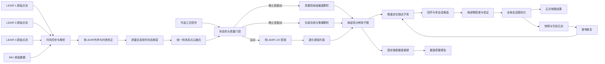

# 井下巷道三激光雷达加 IMU 长期稳定建图方案研究报告

## 执行摘要

你的场景不是“常规移动机器人 SLAM”，而是一个**强退化、强振动、低运动占空比、还要求断电续建**的特种建图问题。真正决定成败的，不是“能不能跑起来”，而是能否同时处理四件事：其一，长直巷道的**沿轴向弱可观测**；其二，掘进机长时间静止但截割导致的**高频振动与伪位移**；其三，三台 16 线机械式激光雷达的**时间同步、外参与联合去畸变**；其四，断电重启后的**可靠重定位与多会话地图融合**。地下 SLAM 综述、隧道/矿井案例和退化环境论文都表明，地下环境中 LiDAR-centric SLAM 仍是主流，但回环误检、几何退化、粉尘/动态遮挡和传感器同步是最常见失败源。citeturn16academia4turn0academia0turn9academia1turn9academia2turn20academia1

结合你给定的硬件，**“三雷达连续时间 LIO 前端 + 退化感知约束 + 多会话图后端 + 独立截面重建流水线 + 可选圆柱反光标靶锚点”**是最稳妥的总体方向。理由很直接：三台 GUJ120 都是 16 线机械式 LiDAR，支持反射率、单/双回波、PTP 时间源，并明确宣称具备多雷达同时工作的抗干扰能力；其 DIFOP 里还有多雷达相位锁定相关字段。你上传的 SIRIUS-F002SP 惯导说明书则给出 0.015° 姿态精度、0.1° 方位精度、0.01°/h 陀螺零偏稳定性，并提供 PPS / EVENTMARK 等接口，但也明确提示“工作时动态过大”会导致输出误差增大。换言之，这套硬件**具备把三雷达做成严肃工程系统的基础条件**，但必须把“震动工况下不乱飘”和“断电恢复不误拼”当成系统一级目标，而不是后处理附属功能。fileciteturn0file3 fileciteturn0file1

从现有方法看，没有一个开源系统可以“一键适配”你的工况。FAST-LIO2 成熟、快、工程启动成本低，但并不专门面向持续振动与隧道弱特征；LIO-SAM 有回环和图优化，但其官方实现对点时间戳、ring 字段、机械 LiDAR 和 9 轴 IMU 假设都很明确，且更像通用 LIO 框架；SLICT / CLINS 这类连续时间方法更贴近你的振动场景，并且 SLICT 原生支持多输入传感器，但集成复杂度与算力要求更高；COIN-LIO 证明了在隧道等几何退化环境中，**反射率/强度信息**确实能补几何约束的短板；BIEVR-LIO 则进一步证明，高分辨率地图表示和“只采样真正有信息的几何细节”能显著提升长直隧道稳健性，但其作者自己也明确指出，**在几何严格退化而强度仍可用的场景中，仅靠几何仍然不够**。citeturn2academia1turn33academia3turn39view2turn6academia2turn19academia1turn20academia1turn33academia0 fileciteturn0file2

因此，本报告的核心建议不是“直接选某一个算法”，而是分两层推进。**工程落地层**建议以成熟开源前端为骨架，优先采用 FAST-LIO2 或 LIO-SAM 的工程化组件，加上 LI-Init、Scan Context++ / ISC、会话化地图管理与重定位数据库，尽快打通采集、同步、记录、重定位、导出整链路。**目标能力层**则建议逐步引入连续时间轨迹、BIEVR/高分辨率局部子图思想、X-ICP / SuperLoc 式退化感知约束，以及基于反射率的辅助残差与标靶锚点机制，最终形成更贴合掘进机工况的专用系统。citeturn11view1turn10view0turn35academia3turn12academia0turn23academia0turn9academia1turn9academia2turn33academia0turn13academia1

如果项目必须给出一句“最推荐的技术路线”，那么结论是：**把“全局建图”和“高质量截面重建”拆层设计**。全局层接受一定长度误差，重点做可靠续建与不误拼；局部层围绕固定链距、静止时段和近距离侧壁点云做高密度、高平滑度、高重复性的截面产品。这一分层思路比“单一全局点云地图同时兼顾所有指标”更符合你的业务目标。相关矿井/地下工程案例也都说明，实际工业价值经常来自**重复扫描、变形监测、局部高质量体积/轮廓**，而不是单一 ATE 指标。citeturn22view0turn16academia0turn16academia1turn16academia4

## 场景定义与设计假设

### 需求边界与问题定义

已知硬件是 **3 个激光雷达 + IMU + 履带式掘进机**。激光雷达布局为 **1 个水平安装、2 个倾斜安装**；里程计不可加；若特征不足，可在巷道内布设**圆柱形反光标靶**，但数量、尺寸、安装高度、是否允许在关键节点加密部署，当前均未指定。你的业务目标是：在井下巷道实现**长期稳定建图**，支持**断电后续建**；允许一定长度误差，但必须保证**截面质量**，尤其是点云密度、平滑度与几何精度。掘进机的典型工作模式又非常特殊：绝大部分时间静止，仅截割头工作引入强烈振动；真正前后移动的总时长每天仅几十分钟。这个工况意味着系统不能把“有振动”错误地解释成“有位移”，否则地图会在静止状态下持续被写坏。这个基本判断也与你此前随附的 v1.2 方案草案中“静止待机 / 静止截割 / 运动 / 断电重定位”分状态处理的思路一致。fileciteturn0file0

### 硬件能力与直接工程含义

你上传的 GUJ120 说明书表明，该激光雷达是**16 线机械式 3D LiDAR**，支持 **5 / 10 / 20 Hz**，垂直视场 **30°**、垂直角分辨率 **2°**、360° 水平扫描，并提供**反射率、单/双回波、PTP 时间源**；说明书还写明其具备**多台雷达同时工作抗光束干扰能力**，并在 DIFOP 中提供可用于多雷达固定相位关系的**电机锁相相位**字段。这些能力对三雷达联合系统非常关键：它们意味着多雷达时间与相位同步**不是空想功能，而是有硬件抓手**。fileciteturn0file3

SIRIUS-F002SP 惯导说明书给出的指标也很重要：方位精度 0.1°、姿态精度 0.015°、陀螺零偏稳定性 0.01°/h，且接口中明确有 **PPS 输出、EVENTMARK**，还带有里程计输入引脚，但本项目约束是不使用履带里程计。更关键的是，说明书在故障分析里明确写了“**工作时动态过大，输出误差较大**”。这意味着你的 IMU 虽然档次不低，但在截割振动阶段不能被当成“无条件可信的短时真值”；它更适合做连续时间去畸变、短时先验、静止偏置校正与启动恢复，而不是在高振动静止阶段单独积分出可靠位移。fileciteturn0file1

基于 GUJ120 的角分辨率，可以对截面采样能力做一个直接工程判断。按圆弧近似，5 Hz 下 0.09° 的水平角分辨率在 5 m 处对应约 **0.8 cm** 的弧长采样间距，10 Hz 下 0.18° 对应约 **1.6 cm**，20 Hz 下 0.36° 对应约 **3.1 cm**；而垂直 2° 在 5 m 处对应约 **17.5 cm**。这说明：**单台 16 线 LiDAR 的垂直向稀疏是客观存在的**，要获得高质量截面，必须依赖倾斜安装、多雷达互补、静止时多帧累积和局部重建，而不能指望单次单帧截面就“天然很密”。同样，由于说明书给出的距离精度在 1.01–20 m 范围内为 ±0.03 m，20 m 外变成 ±0.3 m，因此截面质量应优先依赖**近壁、中近距点**，不宜让远距点主导精细轮廓。fileciteturn0file3

| 距离到壁面 | 5 Hz 水平 0.09° | 10 Hz 水平 0.18° | 20 Hz 水平 0.36° | 垂直 2° |
|---|---:|---:|---:|---:|
| 2 m | 0.3 cm | 0.6 cm | 1.3 cm | 7.0 cm |
| 5 m | 0.8 cm | 1.6 cm | 3.1 cm | 17.5 cm |
| 10 m | 1.6 cm | 3.1 cm | 6.3 cm | 34.9 cm |

表中为按角分辨率推得的几何采样间距，属于设计估算，底层分辨率参数依据 GUJ120 说明书。fileciteturn0file3

### 未指定项与默认假设

有几项信息目前仍是“未指定”，而它们会直接影响算法与验收边界。第一，三雷达具体安装角度、基线尺寸和安装刚度未指定；这关系到外参可观测性、共同视场大小和截面覆盖。第二，是否能获取掘进机“前进 / 后退 / 截割 / 空闲”之类工况信号未指定；如果能拿到，建议只做状态机门控，不可当作位移来源。第三，目标工控机算力、ROS 版本、网络拓扑、是否可做 PTP 主时钟未指定；这会改变连续时间前端是否可实时。第四，巷道典型宽高、断面形状、是否存在管线/电缆/支护网/锚杆密集遮挡未指定；这会决定截面提取策略是“模板拟合”为主还是“自由轮廓重建”为主。第五，标靶安装权限、施工窗口和测量方式未指定；如果标靶能被精确测到矿方坐标系，就能把“续建”从局部问题升级为“可靠对齐到工程基准”的问题。第六，断电后场景是“原地重启”还是“断电后允许被拖动/挪动再重启”，也未指定；这会改变重定位设计和验收标准。以上未指定项，本报告一律以“工程建议值”形式给出初版要求。  

## 详细需求文档

### 功能需求

系统至少应实现六类核心功能。第一类是**多雷达与 IMU 统一时空基准**：三台雷达与 IMU 的时间戳必须进入统一时间系，且系统应具备外参版本管理、时间偏移记录和启动自检。GUJ120 具备 PTP 与多雷达相位锁定相关机制，SIRIUS-F002SP 具备 PPS / EVENTMARK，因此工程上应优先走**硬同步为主、软件标定为辅**的路线；同时保留 LI-Init 一类在线时间/外参校正能力作为安装偏差与老化漂移的保护措施。fileciteturn0file3 fileciteturn0file1 citeturn35academia3turn25academia0

第二类是**状态感知前端**。前端不应该只有“正常跑 LIO”这一种模式，而应至少区分：静止低振动、静止高振动、低速前进、低速后退、重启后待重定位、退化保护等状态。你给的工况决定了“静止但强振动”不是异常，而是主工况之一；因此在这一状态下，系统应优先冻结或强约束位姿，只允许做去畸变、静态点筛选和截面子图累积，而不是把局部抖动写成全局位移。连续时间 LIO、点级去畸变和振动不确定度建模类研究都说明，高频振动条件下，简单离散时间 deskew 往往不够稳健。citeturn19academia1turn19academia2turn26academia0turn26academia3

第三类是**长期多会话地图管理**。系统必须支持 session 概念：每次上电形成一个会话，包含原始数据、关键帧、局部子图、重定位描述子、标靶观测、质量标志和日志；系统重启后不应从零开始建图，而应尝试加载最近一致快照、做粗重定位、局部验证，再决定“接着建”还是“另开会话，稍后人工/自动合并”。RTAB-Map 的公开论文说明了其长期在线和多会话地图能力；而地下场景回环失败往往来自误检，因此这里必须把“会话级重定位验证”放在“搜到候选地方”之后。citeturn13academia1turn0academia0turn18academia1

第四类是**截面成果生产**。截面输出必须是独立于全局地图浏览的正式产品层，至少包括：固定链距切片点云、拟合轮廓线、断面完成度、平滑度指标、局部质量评级、与上一版本的差异量。工业案例中，地下矿山 LiDAR 的最重要价值之一恰恰是体积、轮廓、收敛和变形监测，而不仅是轨迹回放。citeturn22view0

第五类是**断电后续建**。系统应支持多种重启情形：原地重启、原地轻微扰动后重启、回退数米后重启、移动到已知旧段后重启。重定位应综合三种证据：基于地图的 LiDAR 描述子检索、局部精配准验证、以及可选标靶锚点。若存在圆柱反光标靶，则其应作为**高置信锚点**，但不能仅凭“看见一个柱子”就判定全局位置，因为长直巷道中单个圆柱不具天然唯一性。3DUID 研究明确指出，地下/隧道中由于结构对称、重复和遮挡，可靠的几何基准与自动共注册是核心难题。citeturn30academia3

第六类是**质量与安全自检**。至少应包括：时间同步误差监控、外参健康监控、雷达转速/状态监控、IMU 饱和或异常监控、重定位置信度监控、回环候选验证日志、以及地图写入回滚能力。LIO-SAM 官方文档也明确把时间戳不同步和外参错误列为典型问题源。citeturn39view1

### 性能指标建议

下面给出的不是“论文指标”，而是更适合写进项目需求或验收计划的**建议指标初稿**。这些值应在第一轮现场数据后再锁定，但如果现在不写，很容易导致后续开发目标漂移。

| 指标类别 | 建议指标 | 说明 |
|---|---|---|
| 在线位姿输出 | 不低于雷达工作频率；位姿延迟建议 ≤ 1 s | 目标工控机未指定，因此先不绑定 CPU/GPU 型号 |
| 静止低振动假位移 | 建议 ≤ 2 cm/h | 目标是让“静止待机”几乎不写坏图 |
| 静止高振动假位移 | 建议 ≤ 5 cm/h | 截割状态更宽松，但仍应强约束 |
| 原地断电重启续建成功率 | 建议 ≥ 95% | 指同一工作点、无遮挡剧变 |
| 轻微位移后重启成功率 | 建议 ≥ 85% | 指 0–5 m 内、已有旧图可检索 |
| 无标靶长直段长度误差 | 建议控制在行进距离的 1% 以内 | 作为首版工程目标 |
| 稀疏标靶增强后长度误差 | 建议优于 0.3%–0.5% | 作为增强模式目标 |
| 截面重复性 | 同一断面多次独立重建差异中位数建议 ≤ 3 cm | 比单次“绝对精度”更适合作为工程验收 |
| 截面局部几何误差 | 2–8 m 近壁范围内，点到断面拟合轮廓的 RMSE 建议 ≤ 5 cm，95 分位 ≤ 8 cm | 结合 GUJ120 量测精度和多帧融合能力制定 |
| 截面完整度 | 目标断面有效覆盖率建议 ≥ 90% | 对于被设备或支护遮挡区域允许单独标记 |
| 误回环 / 误续建 | 验收集上不允许发生 1 次导致成果图错误拼接的事件 | 这是硬约束 |

这些建议值的物理可行性，需要放在传感器指标背景下理解：GUJ120 在 1–20 m 典型量程给出 ±0.03 m 距离精度，而 IMU 具有较高姿态精度，但振动过大会带来误差放大。也就是说，**截面 3–5 cm 级别的工程目标是合理的，但前提是使用近壁点、多帧融合、良好外参与同步，并禁止高振动伪位移进入全局图**。fileciteturn0file3 fileciteturn0file1

### 操作流程要求

建议把日常使用流程设计成固定 SOP，而不是“开机就跑”。推荐流程是：上电后先做时间同步/外参/传感器健康检查；若有旧会话则加载最近快照；在初始静止窗口内完成 IMU 稳定判断与粗重定位；若重定位通过，则进入“旧图续建”，否则建立新会话并等待后续合并。随后，在静止低振动时以高密度模式维护截面子图，在静止高振动时进入位姿冻结与鲁棒累积模式，在真正前后运动时进入正常 LIO。断电前若有机会，应原子化写入最后一次快照；若突发掉电，则靠 WAL 和最近快照恢复。整个流程中，地图写入必须晚于质量判定，避免坏帧先写入再回滚。  

### 数据记录与恢复策略

数据记录策略应分为**原始层、状态层、成果层**三层。原始层建议完整保存每台雷达的原始 UDP 数据流、DIFOP/设备信息包、IMU 原始测量与解算输出，以及所有同步与配置文件。这样做的原因是：GUJ120 的数据包包含测距、反射率、时间戳与设备信息，后续如果要改解析、重做去畸变、切换单双回波策略或修时间同步，只有原始数据才能支持可重复重处理。fileciteturn0file3

状态层应保存：关键帧位姿、局部子图索引、地图版本号、会话图、描述子数据库、候选回环与验证结果、标靶观测列表、重定位日志、质量标签、异常告警。成果层则保存：正式断面、导出的点云地图、质量报告和版本化成果。建议采用**“快照 + 写前日志”**机制：每隔固定时间和固定里程双门限保存一次一致快照，例如每 30–60 s 或每累计 5–10 m 保存一次；任何地图修改先写 WAL，再提交到正式快照索引。这样即使突然断电，也最多丢失最近一个小窗口，不会损坏整个工程库。  

如果按原始雷达 UDP 包粗略估算，单台 GUJ120 的原始流量大致在数 MB/s 量级，三台全天记录时，单日原始数据可能达到**数百 GB**。因此，数据策略不应是“什么都无限期保留”，而应是：关键日 / 异常日 / 标定日保留全量原始，常规生产日做分级留存。估算依据来自 GUJ120 的固定包长和高频 UDP 输出机制。fileciteturn0file3

### 标靶部署建议

考虑你的限制条件是**只能加圆柱形反光标靶**，不一定能加复杂编码靶，因此建议把标靶定位成“**稀疏高置信锚点**”，而不是“连续导航主传感器”。3DUID 研究在地下环境中证明了：唯一化参考体与自动共注册对地下点云建模、轮廓提取和变形监测都有重要价值；LiDARTag 也说明，LiDAR 可识别的人工地标可以作为可靠姿态锚点。虽然这两者都不是“单根圆柱反光柱”的同构实现，但它们共同支持一个结论：**如果要靠人工标志帮助续建，唯一性设计与误检抑制比“能不能看见”更重要**。citeturn30academia3turn32academia0

建议优先布设在四类位置：其一，断电高发或经常切换班次的工作点前后；其二，长直且纹理贫乏的低特征段；其三，岔口、坡变、转弯、设备停靠位等拓扑节点；其四，距工作面一定安全距离的稳定区段。安装上建议采用**非等间距、左右侧错开、安装高度错开**三种编码手段共同使用。不要把多个点位做成等距重复，因为长直巷道会放大“看起来都像”的问题。单个标靶本身不必充当唯一 ID，但它应与周边稳定几何一起构成“局部锚点包”。这和你此前上传草案中“单标靶 + 周边特征共同确定身份”的思路高度一致。fileciteturn0file0

| 部署方案 | 适用场景 | 优点 | 主要风险 | 建议结论 |
|---|---|---|---|---|
| 不布设标靶 | 特征丰富、有稳定回退重访 | 施工成本最低 | 长直重复段和断电重启歧义大 | 仅适用于试验初期或条件较好段 |
| 仅关键节点稀疏布设 | 班次切换点、岔口、停靠位 | 性价比高，对续建帮助直接 | 长直段中间仍可能漂移 | **推荐作为最低工程配置** |
| 长直段等间距布设 | 仅追求覆盖方便 | 施工简单 | 唯一性差，误匹配风险大 | 不推荐 |
| 长直段非等距+左右侧+高度错开 | 低特征长直段 | 兼顾唯一性与成本 | 需要施工管理 | **推荐作为增强配置** |
| 工作面附近密集布设 | 经常原地重启、强动态区 | 有利于快速续建与局部对齐 | 易被遮挡、碰撞或损坏 | 推荐只在热点区局部加密 |

### 验收标准建议

验收不应只做一次公开演示，而应按以下四组场景分别通过：**静止低振动、静止高振动、短时前后运动、断电重启续建**。每组都要出具原始数据、轨迹、截面成果、质量统计和异常日志。正式验收中至少应包含：无标靶模式 A/B 测试、带标靶增强模式 A/B 测试、同段重复扫描、不同班次重启续建、工作面附近强干扰工况。任何一次误回环导致的错误拼图，均应视为严重缺陷。  

## 文献与案例综述

### 与本项目最相关的资料谱系

公开、可快速访问、且与你的工况直接相关的中文开放资料并不多；本次可高置信使用的中文原始资料，主要来自你上传的**设备说明书**与**已有方案草案**。其中，GUJ120 说明书提供了传感器工作模式、时间源、相位锁定、回波模式、ROS 驱动与矿用属性；SIRIUS-F002SP 说明书提供了惯导精度、PPS / EVENTMARK、快速恢复和“动态过大误差增大”的关键信息；你上传的 BIEVR-LIO 预印本则与“长直隧道细微几何利用”高度贴合；v1.2 草案则很好地暴露了你团队已经意识到的状态机、单标靶和断电续建问题。fileciteturn0file3 fileciteturn0file1 fileciteturn0file2 fileciteturn0file0

地下/矿井一线研究方面，DARPA SubT 综述指出地下环境中的 SLAM 仍以 LiDAR 为主干；CERBERUS、Rhino 和 LG-SLAM 等案例都证明了 LiDAR-IMU 是地下地图构建的主流组合，但也共同暴露了几何退化、回环误检、动态遮挡与工况变化这些老问题。尤其值得注意的是，2025 年针对地下隧道的实证研究直接指出，循环检测往往是**假阳性最多的故障源**。这与你的“断电后续建”和“前后短程重访同一巷道”的需求高度相关。citeturn16academia4turn16academia1turn16academia0turn37academia1turn0academia0

### 对你的方案最有价值的原始论文

下表不是“所有相关文献”，而是对你落地最有用的一组。

| 文献 / 系统 | 与本项目的直接关系 | 对你的启发 | 依据 |
|---|---|---|---|
| FAST-LIO2 | 成熟、工程常用、直接 scan-to-map、开源 | 适合作为首个可跑通的工程基线前端 | citeturn2academia1turn11view1 |
| LIO-SAM | 图优化、回环、工程成熟、开源 | 可作为后端/图优化参考，但需注意其对点时间戳、ring、机械 LiDAR、9 轴 IMU的假设 | citeturn2academia0turn39view2 |
| SLICT | 连续时间、多输入、多尺度 surfel、开源 | 非常适合三雷达 + IMU 与振动场景，是目标架构的重要参考 | citeturn6academia2 |
| CLINS / DLIO / SR-LIO | 连续时间或更强 deskew | 证明“强运动/强振动下连续时间建模更合适” | citeturn19academia1turn19academia2turn26academia3 |
| COIN-LIO | 几何 + 强度，专门针对隧道/平原退化环境 | 说明反射率不是“可有可无”，而是你的重要补充约束来源 | citeturn20academia1 |
| BIEVR-LIO | 高分辨率几何表示 + 只采样有信息细节 | 对长直隧道极具启发；但作者也明确承认纯几何在极端退化时仍会受限 | citeturn33academia0 fileciteturn0file2 |
| X-ICP / SuperLoc | 退化检测与局部可定位性约束 | 适合做“弱约束方向冻结 / 降权 / 风险预警” | citeturn9academia1turn9academia2 |
| Scan Context++ / ISC / LiDAR Iris / MinkLoc3D-SI | 场景检索、重定位、回环候选 | 用于断电重启后的粗定位与多会话匹配；ISC/MinkLoc3D-SI 还能利用强度 | citeturn12academia0turn23academia0turn36academia1turn36academia0 |
| RTAB-Map | 大规模、长时在线、多会话开源框架 | 更适合作为 session 管理与长期图库思路参考，而非你的强振动主前端 | citeturn13academia1 |
| 3DUID | 地下环境自动共注册、唯一化参考体、断面提取 | 直接支持“标靶要唯一化、要服务于续建和剖面”这一结论 | citeturn30academia3 |
| LI-Init | LiDAR-IMU 时间/外参初始化 | 三雷达联合系统必须把时差和外参校正纳入正式流程 | citeturn35academia3 |

### 工业案例与开源实现

工业侧最有参考价值的是地下矿山测绘与收敛监测实践。Emesent 的官方矿业页面明确把**stope 扫描、drift 收敛监测、变形追踪、旧巷道数字化、ore pass / shaft 检查**列为核心应用，并给出“重复扫描可做变形监测”“drifts/orepasses/chutes 的重复扫描便于跟踪变化”的说法；页面还给出“某些工况下 surveyors 可比传统方法快到 75%”这类厂商口径指标。需要注意，这属于厂商公开材料，应把它当作“工业需求与工作流证明”，而不是你项目的性能承诺。citeturn22view0

开源实现方面，FAST-LIO 官方仓库确认其面向多类型 LiDAR、支持外部 IMU，并给出 ikd-Tree、直接点对地图等关键机制；LIO-SAM 官方 README 则明确要求点时间戳、ring 字段、机械 LiDAR、9 轴 IMU 等输入前提；RTAB-Map 的 2024 论文则系统总结了其大规模、长时在线、多传感器 SLAM 定位；Scan Context++、SLICT、LI-Init 等则补足重定位、多传感器与初始化。对你来说，真正有价值的不是“哪个 repo 最火”，而是：**哪些模块可以直接借，哪些要自研状态机与地图库**。citeturn11view1turn39view2turn13academia1turn12academia0turn6academia2turn35academia3

## 算法评估与推荐方案

### 候选方案评估结论

如果只选一个现成前端，FAST-LIO2 是最适合做**第一阶段工程基线**的。它成熟、快、开源、直接以原始点做 scan-to-map，不依赖手工边缘/平面特征，且官方仓库明确支持多类型 LiDAR 与外部 IMU。它尤其适合在你们第一阶段快速回答两个问题：同步是否已打通、外参是否可用、三雷达融合后基础地图质量是否达标。citeturn2academia1turn11view1

但如果目标是“最终真正在掘进机上长期稳定生产”，单靠 FAST-LIO2 又不够。原因在于：你的主工况不是常规移动，而是**静止强振动**；你的主环境也不是开放场景，而是**长直、重复、低信息巷道**。在这两个维度上，SLICT / CLINS 这一类连续时间方法、COIN-LIO 这一类强度增强方法，以及 BIEVR-LIO 这一类高分辨率局部几何方法，都比通用基线更贴题。BIEVR-LIO 在 Shield/Tunneling 之类退化序列上展示了利用细微几何约束的能力，但作者同时也明确写出：在 ENWIDE 的 Tunnel 这类**几何严格退化**场景中，仅靠几何仍然不如强度辅助方法稳定。这一点对你非常关键，因为 GUJ120 恰好提供反射率。citeturn6academia2turn19academia1turn20academia1turn33academia0 fileciteturn0file2

### 推荐总体架构

推荐采用“**多 LiDAR 连续时间前端 + 局部高分辨率截面子图 + 退化感知与锚点重定位 + 多会话图后端**”的组合式方案，而不是指望一个开源包全包。具体来说：

1. **同步与标定层**  
   以 IMU 为时间主轴，优先使用 PPS / PTP / 相位锁定等硬同步能力，把三台 LiDAR 转到同一时基；保留 LI-Init 类在线偏移与外参校正模块作为安装与老化保护。fileciteturn0file3 fileciteturn0file1 citeturn35academia3turn25academia0

2. **前端状态机层**  
   把前端拆成“静止低振动”“静止高振动”“运动”“重启待定位”“退化保护”几种模式。静止高振动时，姿态可以允许微调校正，但平移必须强约束甚至冻结；只有在 LiDAR-IMU 都证明发生真实位移时，才允许更新全局轨迹。这里如果后续真能接入掘进机工况信号，可以作为先验门控；但即便能接入，也只应做门控，不能代替里程计。fileciteturn0file0

3. **前端配准层**  
   在实现上，建议采用“每台 LiDAR 先独立去畸变，再变换到 IMU / 机体坐标，再联合配准到公共局部子图”的结构，而不是先粗暴合并原始帧再统一 deskew。因为三台机械 LiDAR 本身存在相位与时间差，如果不先在各自时间线上完成点级校正，合并后误差会被放大。LIO-SAM 官方对点时间戳和 ring 字段的要求，也间接说明了点级时序对机械 LiDAR deskew 的关键性。citeturn39view2turn39view3

4. **退化感知层**  
   不要等配准失败了再补救，而应在匹配前 / 匹配中实时估计“沿巷道主轴是否仍可观测”。可借鉴 X-ICP / SuperLoc 的思想，对弱约束方向做冻结、限幅或降权；在直线低纹理长段，如果 Hessian / Jacobian 条件数恶化，就主动触发“弱更新 + 等下一次更好观测 + 等标靶 / 回访 / 强度特征”的策略。citeturn9academia1turn9academia2

5. **强度与标靶辅助层**  
   由于 GUJ120 有反射率，而且 BIEVR-LIO 也承认纯几何在部分极端隧道里不够，因此强烈建议把**反射率**纳入正式设计，而不是后备功能。第一阶段可先把反射率用于标靶检测与局部质量筛选；第二阶段再评估是否引入 COIN-LIO / ISC 式强度残差或强度描述子。fileciteturn0file3 citeturn20academia1turn23academia0 fileciteturn0file2

6. **后端与会话管理层**  
   借鉴 RTAB-Map / LG-SLAM 的 session 与图管理思想，把“旧图定位、会话对齐、回环验证、地图压缩”做成独立后端，而不要让前端一边实时估计、一边直接改全局成果图。回环候选可由 Scan Context++ / ISC / LiDAR Iris / MinkLoc3D-SI 提供，接受前必须经过局部 ICP/BIEVR 精配准与轨迹一致性验证。citeturn13academia1turn37academia1turn12academia0turn23academia0turn36academia1turn36academia0turn18academia1

### 推荐方案的结构草图

这张图里的关键设计意图是：**截面成果链路和全局续建链路共用底层感知，但不共享同一个“写图时机”**。这样全局轨迹偶尔有小漂移，不会立刻把截面成果毁掉；反过来，静止时的大量高质量局部点也能真正用于“截面精修”，而不是被全局稀疏地图吞没。  

### 截面重建方法比较与推荐

| 方法 | 适合你的程度 | 优点 | 主要问题 | 结论 |
|---|---|---|---|---|
| 固定链距切片 + 离群点剔除 + 样条/自由轮廓拟合 | 很高 | 对任意巷道轮廓都适用；最容易生成平滑、高密度成果 | 依赖链距定义与局部坐标稳定 | **最推荐** |
| 参数化模板拟合 | 中 | 若断面形状固定，参数少、易出报告 | 真实巷道常有局部超挖、附属物、非规则支护 | 只适合标准化断面 |
| 先建 TSDF / 隐式体再切片 | 中 | 表面连续，视觉效果好 | 内存与实时性压力较大；对在线系统更复杂 | 可做离线精修 |
| 先建网格 / Poisson 再切片 | 低到中 | 适合离线展示 | 动态遮挡与噪声下容易过拟合或补洞错误 | 不建议做在线主线 |

推荐的正式截面产品线是：**固定链距切片 + 近壁优先 + 局部法向坐标系 + 鲁棒离群点剔除 + 样条/分段轮廓重建 + 质量标签**。如果巷道有设计断面，可额外输出“与设计模板偏差”；如果没有，就输出“多时刻断面差异”和“局部收敛/扩帮”。  

### 推荐初始参数

以下参数是**首轮现场试验建议值**，不是最终定版。

| 参数项 | 建议初值 | 说明 |
|---|---:|---|
| LiDAR 频率 | 运动时优先 10 Hz；静止精修可试 5 Hz | 10 Hz 更利于降低单圈畸变；5 Hz 水平更密，适合静态精修 |
| 关键帧触发 | 位移 0.2–0.5 m 或转角 1–2° 或时间 1–2 s | 低速工况下不宜过疏 |
| 局部子图长度 | 5–15 m | 兼顾局部细节与计算量 |
| 正式断面输出间隔 | 0.1–0.25 m 链距 | 截面质量优先时不宜过稀 |
| 标靶热点部署间距 | 工作点前后 5–15 m | 便于重启续建 |
| 长直低特征段标靶间距 | 20–40 m，且非等距 | 需结合现场可施工点位调整 |
| 快照周期 | 30–60 s 或 5–10 m 双门限 | 防止掉电损失过大 |
| 静止判定窗口 | 2–5 s | 需和振动频带一起调参 |
| 近壁截面主用点范围 | 建议 2–8 m | 兼顾精度与密度 |

## 风险、模糊点与落地不确定性

### 高风险项排序

| 风险等级 | 风险项 | 影响 | 缓解措施 | 验证方法 |
|---|---|---|---|---|
| 很高 | 三雷达与 IMU 时间不同步、外参不稳 | 直接造成重影、虚假截面、续建失败 | 硬同步优先；外参版本化；安装刚度检查；LI-Init / 离线重标定 | 静止墙面重影量、闭环一致性、重启前后差分 |
| 很高 | 静止截割振动被误判为位移 | 地图在 23 h 主工况下持续写坏 | 状态机冻结平移；连续时间去畸变；振动期质量门控 | 长时间静止切割实验，统计假位移 cm/h |
| 很高 | 长直低特征段沿轴向退化 | 长度漂移、误续建、假回环 | 退化检测；强度辅助；标靶锚点；高分辨局部几何；会话验证 | 长直段 A/B 测试：无增强 / 强度 / 标靶 |
| 高 | 断电重启场景歧义 | 接到错误位置，整图污染 | 多证据重定位；候选后必须精配准+轨迹一致性验证 | 原地、轻移、回退后重启重复试验 |
| 高 | 粉尘、水雾、动态切削头、人员遮挡 | 局部配准污染、截面虚点 | 单/双回波 A/B；时序一致性滤波；动态遮挡屏蔽 | 现场强干扰工况重复采样 |
| 高 | 单根圆柱标靶不具唯一性 | 标靶增强反而引入误匹配 | 非等距、左右、不同高度；与周边稳定几何联合验证 | 盲测误识率 / 假阳性率统计 |
| 中 | 计算资源不足 | 连续时间方案无法实时 | 分层实现：先工程基线后升级；局部高分辨只在重点区域启用 | CPU/GPU profiling，逐模块压测 |
| 中 | 仅少量运动导致数据集不平衡 | 参数难调，场景覆盖不足 | 设计专门的短时移动测试集与重启集 | 每一类工况单独统计，不混为总平均 |
| 中 | 无绝对基准 | 很难客观定义“长度误差” | 用标靶测量、手持 TLS / 全站仪抽检、重复性替代 | 基准段对比 + 重复性统计 |

### 影响落地的模糊点

当前最需要尽快澄清的不是“选哪个算法”，而是下面这些工程事实：

| 未明确项 | 为什么重要 | 建议处理 |
|---|---|---|
| 三雷达精确安装角度与基线 | 决定共同视场、外参可解性、截面覆盖 | 尽快给出 CAD 或实测安装图 |
| 是否能拿到工况状态信号 | 决定能否做状态门控 | 若能拿到，只做状态机先验，不作里程计 |
| 工控机型号、CPU/GPU、网口数量 | 决定是否可上连续时间多雷达 LIO | 在需求文档中单列“目标硬件平台” |
| 巷道典型尺寸、坡度、附属结构 | 决定截面算法与遮挡模型 | 优先收一批现场照片和短包数据 |
| 断电后是否可能被拖动再重启 | 决定重定位难度与验收用例 | 必须纳入验收场景 |
| 标靶允许数量与安装权限 | 决定增强模式设计空间 | 与矿方同步可施工策略 |
| 是否存在人工测量真值条件 | 决定最终验收方式 | 至少布设若干基准断面与基准靶点 |

## 测试验证与系统架构

### 仿真与现场测试用例

仿真用例不需要追求“超真实物理”，而应追求**把失败模式提前打出来**。建议至少构造四大类仿真：第一类是长直重复巷道，调节壁面粗糙度与局部细节幅值，验证退化感知与高分辨率地图表示是否真的起作用；第二类是静止强振动，给 LiDAR 与 IMU 注入可控振动谱，验证冻结/去畸变策略；第三类是三雷达时间偏移与外参误差扫描，验证系统对同步和安装误差的脆弱性；第四类是断电重启与局部位移后重定位。仿真目的不是代替现场，而是先找出对同步、退化与重定位最敏感的参数区间。  

现场测试则建议按“由浅到深”分五批做。第一批是**静态标定批**：在不截割、无遮挡的短巷道里做时间同步、外参、近壁点密度、截面重复性测试。第二批是**静止振动批**：原地开启截割或等效振动，重点统计假位移和截面稳定性。第三批是**短程移动批**：前进、后退、停、再前进，验证轨迹连续性与前后重访一致性。第四批是**断电批**：同点重启、小位移重启、回退重启、跨班次重启。第五批是**标靶增强批**：无标靶、稀疏标靶、长直段非等距标靶三种模式做 A/B/C 比较。这样设计后，你能非常快地看出：到底是前端不稳、同步不稳、还是重定位不稳。  

### 数据采集方案

建议每个现场序列都同时保存以下内容：三雷达原始包、IMU 原始与解算数据、同步配置、外参版本、系统日志、关键帧数据库、会话图、重定位候选、与正式成果导出。每类工况至少收集 **10 条以上**可重复序列；对于静止振动与断电重启场景，建议每个点位至少重复 **5–10 次**，否则统计显著性不足。对于标靶实验，要有“完全看不见标靶”“只看见 1 个标靶”“同时看见 2 个以上标靶”三种可见性子集。  

如果现场允许，建议用以下任一方式构造真值或近真值：局部手持 TLS / 站式扫描基准、全站仪对若干人工靶点的精确测量、或至少对几个典型断面做人工复测。若无法获得连续轨迹真值，也至少应确保**断面真值**与**重复性真值**可得，因为你的业务 KPI 本来就优先是截面，而不是全局轨迹。  

### 评价指标、统计方法与可视化建议

评价指标不应只用 ATE / RPE 两个机器人学老指标。建议同时做四组：

**轨迹类指标**：ATE、RPE、断电重启后相对旧图的初始对齐误差、长直段单位里程漂移、静止状态假位移率。  
**截面类指标**：点到断面拟合轮廓残差、断面重复性、完整度、平滑度、相邻断面变化连续性。  
**重定位类指标**：候选召回率、验证通过率、误接受率、平均重定位时间、带 / 不带标靶成功率。  
**工程资源类指标**：CPU、内存、磁盘写入、原始数据存储量、单次快照时间、重启恢复时间。  

统计方法建议优先用**中位数、95 分位、Bootstrap 置信区间**，并采用**配对实验**比较不同方法或参数，而不是只看总平均值。因为你的工况极不均匀，平均值很容易掩盖“静止切割时其实一直在慢慢漂”的问题。若样本量不大，方法间比较建议用配对 Wilcoxon 等非参数统计。  

可视化上，建议固定输出以下图件：  
其一，**误差随时间 / 链距折线图**，把静止振动、移动、重启等事件点标在图上。  
其二，**同一断面多次重建叠加图**，这是最能说服业务侧的图。  
其三，**局部可观测性 / 条件数热力图**，看系统在哪些段天然发虚。  
其四，**重启重定位成败矩阵**，横轴是重启条件，纵轴是方法配置。  
其五，**标靶可见距离-角度成功率热图**，用来确定现场安装规范。  
其六，**不同方案的箱线图或小提琴图**，比单个均值更能体现稳健性。  

### 最终推荐的实施路径

从项目管理角度，建议按三阶段推进。

第一阶段是**两个月左右的工程基线阶段**：打通三雷达 + IMU 驱动、同步、记录、外参标定、基础前端、原地重启和短程前后运动；此阶段优先选择成熟开源实现做骨架，以尽快暴露同步、安装与数据问题。推荐基线：FAST-LIO2 风格前端 + LI-Init + 简单 session 管理 + Scan Context++ / ISC 描述子库。citeturn11view1turn35academia3turn12academia0turn23academia0

第二阶段是**面向场景的增强阶段**：引入静止高振动冻结机制、连续时间或准连续时间去畸变、退化感知约束、标靶检测与重定位验证、正式断面产品链。此阶段重点不是追总体 ATE，而是让“静止 23 h 不写坏图”和“断电后能可靠接回去”真正稳定下来。citeturn19academia1turn26academia0turn9academia1turn9academia2

第三阶段是**高质量截面与复杂段攻坚阶段**：把 BIEVR-LIO 的高分辨局部表示思想、COIN-LIO 的强度辅助思想和 3DUID 式锚点思路吸收进来，形成真正适合你工况的专用方案。到这个阶段，系统应该已经不再是“拼装开源”，而是“有明确工程行为边界的产品原型”。citeturn33academia0turn20academia1turn30academia3 fileciteturn0file2

### 开放问题与局限

本报告已经尽量把现有公开资料、你上传的设备说明、地下案例、原始论文和开源实现整合成可执行方案，但仍有三点必须强调。第一，**没有外部绝对参考时，长直重复巷道中的全局长度误差不可能被“算法完全消灭”**；你能做的是尽量减小、及时检测，并用重访、强度和标靶去约束。第二，**三台 16 线 LiDAR 当然能显著提升覆盖，但并不自动等于“纵向可观测性充分”**；如果巷道本身高度重复，沿轴向仍然会弱。第三，最终能否把截面做到你想要的质量，核心并不只看算法名词，而是看**同步、安装刚度、近壁可见性、静止振动门控和正式截面产品链**是否被认真当成一等公民。以上三点，也是本项目最应该优先验证的部分。