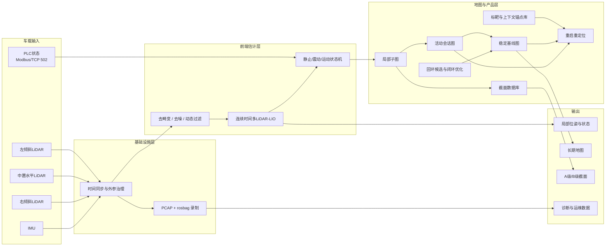
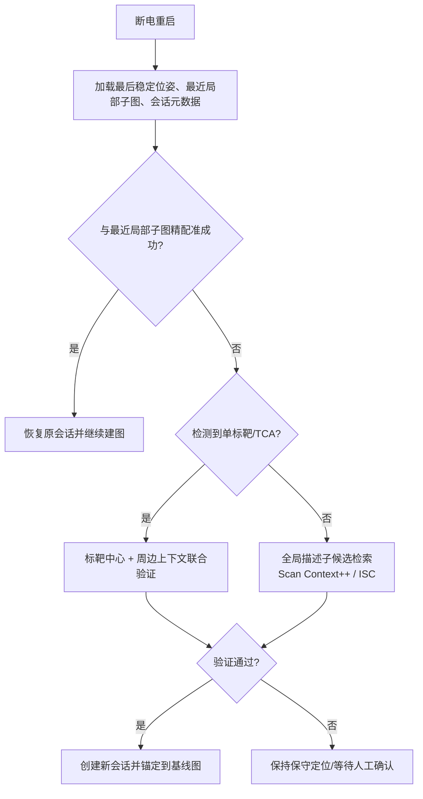
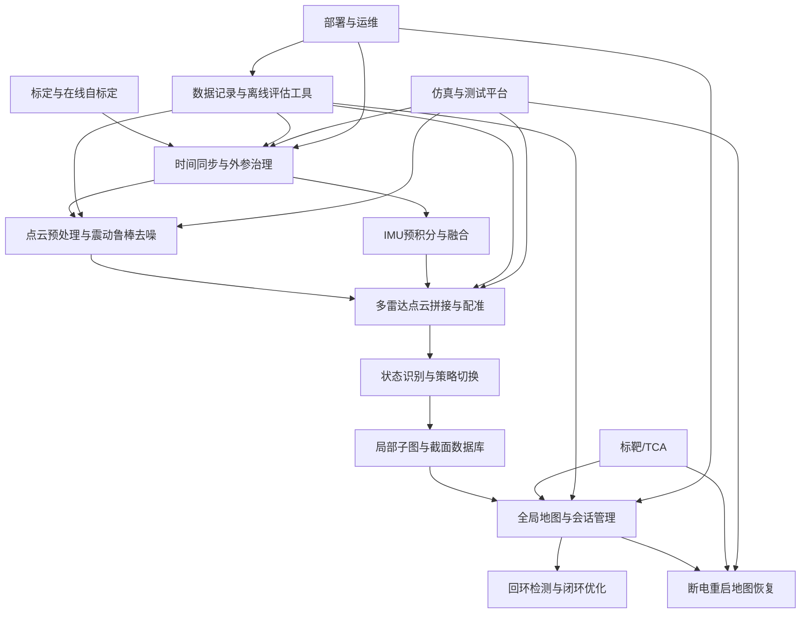
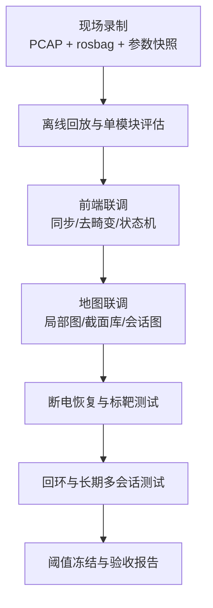
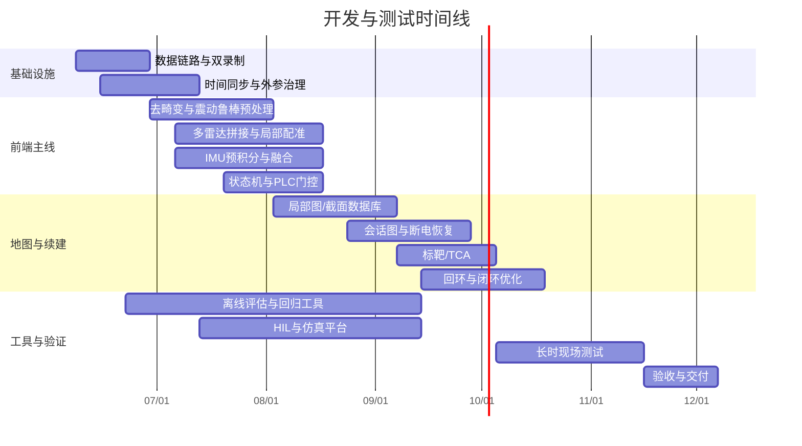

# 履带式掘进机井下三激光雷达加 IMU 长期稳定建图与断电后续建开发实施分析报告

## 执行摘要

你的需求在工程上**可做**，但不适合用“普通单雷达 LIO 直接改一改”来完成。井下巷道、地铁隧道、矿山巷道这类环境普遍同时具有几何退化、重复结构、错误回环风险高、动态施工面干扰强等特点；BIEVR-LIO、X-ICP、SuperLoc 和 LAMP 等工作都把隧道、走廊、矿山、洞穴这类场景视为 LiDAR 配准和长期定位的典型困难环境。citeturn27academia1turn0academia2turn9academia0turn10academia2

结合你的约束条件——三台 LiDAR、一台 IMU、ROS1、无履带里程计、可读取 PLC 状态、允许稀疏安装圆柱反光标靶、断电后原地重启——最可执行的路线不是“押注单一算法”，而是采用**连续时间多雷达前端 + 几何优先局部高分辨率地图 + 状态机门控 + 会话化地图治理 + 保守回环 + 稀疏标靶锚点**的组合方案。SLICT 明确支持 multi-input、continuous-time LIO；FAST-LIO2 具备高效直接点到图配准和外部 IMU 支持；LIO-SAM 提供成熟的因子图与后端参考；Scan Context++ 与 ISC 适合做回环候选；ROLL 与 SLAM2REF 证明了“临时会话图先建，可靠后再并图”对长期定位/长时地图维护是有效的。citeturn0academia1turn0academia3turn3academia1turn23academia0turn1academia0turn11academia2turn12academia0

你当前优化方案里最应该保留的三点是：**把“静止待机”与“静止截割”分开；把 PLC 只作为工况门控而不是里程计；把单标靶升级为“标靶加周围上下文锚点”**。其中前两点直接决定你能不能避免“车没动但地图在漂”；最后一点直接决定你在极长、极重复巷道里能不能在断电重启和弱特征段稳住。Pole-Image、杆状目标长期定位、隧道设施点定位等研究都说明：杆状或柱状目标易检测、稳定，但**单个目标本体通常不足以提供唯一性**，必须与周边几何/强度/局部子图共同使用。citeturn10academia0turn10academia1turn11academia1

就落地优先级而言，真正的 P0 事项只有五件：**时间同步链路、TF/外参治理、静止强振动状态识别、局部/全局地图分层、截面验收口径冻结**。如果这五件事不先冻结，后面再加任何“更先进”的算法，都只是在让系统更复杂，而不是更稳定。多传感器连续时间标定和 LI-Init、iKalibr 这一类工作都把时空标定看作前提；BIEVR-LIO、COIN-LIO、X-ICP、SuperLoc 则分别从细粒度几何、强度辅助、退化约束、对齐风险预测等角度说明，退化隧道场景需要的是**体系设计**，不是单点算法替换。citeturn14academia0turn22academia3turn27academia1turn24academia2turn0academia2turn9academia0

从开源复用角度看，最现实的技术路线是：**SLICT 作为多雷达连续时间候选前端，FAST-LIO2 作为紧耦合高效基线，LIO-SAM 作为因子图后端参考，Scan Context++/ISC 作为回环候选模块，RTAB-Map 作为可视化、多会话工具链与离线分析辅助**。LIO-SAM 的仓库明确说明其原始实现是 ROS1；FAST-LIO2 仓库说明其支持原始点直接配准和外部 IMU；SLICT 仓库则保留了 ROS1 Noetic tag；Scan Context 官方仓库明确给出了与 LIO-SAM、FAST-LIO2 的集成示例；RTAB-Map 仓库持续提供 ROS1 Noetic 二进制。citeturn18view0turn30view0turn18view1turn18view2turn30view1



## 系统目标与约束

你的系统目标可以概括为一句话：**在井下巷道内，以截面质量优先于全局长度精度为原则，用三激光雷达加 IMU 完成长时稳定建图，并在断电原地重启后继续增量建图。** 这类目标与公开研究中“隧道/矿山退化环境下的鲁棒 LIO、长期定位、会话地图维护、保守回环”高度一致；不同的是，你的现场工况加入了**长时间静止强振动**这一非常少见但极关键的约束。citeturn27academia1turn24academia2turn10academia2turn11academia2turn12academia0

按你提供的设备与说明书，GUJ120 为 16 线机械旋转 LiDAR，可配置 5/10/20 Hz，支持单回波/双回波、PTP、UDP/IP 以太网输出；SIRIUS-F002SP 提供 PPS 输出、EVENTMARK 输入和快速恢复能力。对这个项目而言，这意味着你具备做**硬件级时间基准链路**的条件，而不是只能依赖 ROS 到达时间。fileciteturn0file3 fileciteturn0file1

| 类别 | 已知条件 | 工程含义 | 状态 |
|---|---|---|---|
| 车载传感器 | 3 LiDAR + 1 IMU；1 水平、2 倾斜 | 可形成多视角互补；但三台 16 线并不等于严格同步的“等效一台高线数 LiDAR”，必须处理异步与外参问题 | 已指定 |
| 里程计 | 不可添加履带式里程计 | 所有位移、链距、续建都必须由 LiDAR–IMU 确认，PLC 不能代替位姿传感器 | 已指定 |
| 可选人工设施 | 可加圆柱反光标靶 | 可用作高可检测锚点，但不能把单柱本体当作天然唯一 ID | 已指定 |
| 中间件 | ROS1 | 适合现阶段快速开发；但 ROS1 只能做分发与录制层，不宜作为融合主时钟 | 已指定 |
| 网络 | 雷达与工控机同一交换机 | 有利于 PTP 与统一抓包；但交换机是否支持硬件时间同步能力仍需确认 | 部分指定 |
| 断电续建 | 原地重启 | 非常有利于“最后稳定位姿 + 最近子图”快速恢复；但仍要验证液压回弹/微位移 | 已指定 |
| PLC 状态 | 可通过 TCP/502，寄存器可配置；含左右行走状态和截割电机状态 | 可做状态机门控、异常检测、空转判别；不可做位移积分 | 已指定 |
| 场景形态 | 矩形或拱形巷道，存在管线、电缆、支护网、锚杆 | 截面定义必须区分“观测截面”与“结构截面”；固定附属构件处理规则需提前冻结 | 已指定 |
| 优先目标 | 截面质量第一；全局长度误差可适度放宽 | 系统应采用“轨迹链路”和“截面产品链路”解耦设计 | 已指定 |

| 未明确参数 | 当前状态 | 对落地的影响 | 建议冻结时点 |
|---|---|---|---|
| 三台雷达实际转速 | 未指定 | 影响水平角分辨率、运动去畸变难度、原始流量与截面密度 | 第 2 周 |
| 单/双回波模式 | 未指定 | 影响粉尘穿透、网状构件边缘、伪点抑制 | 第 4 周 |
| PLC 轮询周期与实际延迟 | 未指定 | 影响状态切换滞后与“指令动未位移”识别 | 第 3 周 |
| 工控机 CPU / RAM / NVMe | 未指定 | 影响在线多雷达前端和全量日志策略 | 第 2 周 |
| 交换机 PTP 能力 | 未指定 | 决定能否采用完整硬件时间同步 | 第 2 周 |
| IMU 原始输出率、量程、滤波参数 | 未指定 | 决定强振动去畸变是否可信 | 第 3 周 |
| 巷道典型宽高与最小净空 | 未指定 | 决定侧雷达角度优化与覆盖仿真 | 第 3 周 |
| 标靶允许安装的高度/侧别限制 | 未指定 | 决定单标靶唯一性设计空间 | 第 5 周 |
| 断电后的上电时序与文件恢复窗口 | 未指定 | 决定是否要做会话快照先写盘再确认的双阶段恢复 | 第 5 周 |

在多 LiDAR 和异步融合问题上，文献非常一致地强调：三台 LiDAR 提升的是视场和潜在点密度，但同时也引入了**时间不一致、空间外参、重叠区一致性、不同扫描相位**等复杂性；这就是为什么 SLICT、异步多 LiDAR–IMU、连续时间 LiDAR–IMU、iKalibr 之类方法都把时空建模放在前面。citeturn0academia1turn28academia0turn9academia1turn14academia0turn14academia3

## 方案可行性与关键修正

总体结论是：**你当前优化方案的方向是对的，工程上可落地；但要把“可行”变成“可验收”，还必须补齐一组会直接影响实施的模糊点。** 这些模糊点大多不在“选哪篇论文”，而在“时间基准怎么定义、地图什么时候写、什么叫好截面、什么时候拒绝重定位与回环”。退化感知、对齐风险预判、错误回环拒绝、会话化地图治理这几类公开工作都说明，地下重复环境下最重要的是**保守性**。citeturn0academia2turn9academia0turn10academia2turn11academia2turn12academia0

| 方案项 | 可行性判断 | 当前模糊点 | 对落地的影响 | 修正建议 | 替代方案 |
|---|---|---|---|---|---|
| 中置水平 LiDAR 为主参考 | 高 | 参考坐标系是否已锁定为全系统根坐标 | 若根坐标不统一，外参与地图索引会长期混乱 | 固定 `base_lidar_center` 为雷达根；所有 TF 版本化管理 | 若 IMU 更接近几何中心，也可用 `imu_link` 为根，但需一次性冻结 |
| 两个倾斜 LiDAR 辅助覆盖 | 高 | 给定矩阵方向语义仍有歧义；倾角、重叠率、遮挡率未冻结 | 影响拼接、截面边缘双线、覆盖盲区 | 先做覆盖仿真，再冻结角度；要求 20%–40% 有效重叠，交叉截面盲区尽量 <5% | 若现有支架难改，先不改角度，只做 TF 审计与覆盖评估 |
| ROS1 作为主时钟 | 低 | “主时钟”的定义不清 | 容易把 ROS 到达时间误当采样时间，直接毁掉去畸变 | 改为“ROS1 做分发/录制；融合主时间来自 LiDAR/IMU 设备时间” | 若硬件时间链路暂不可用，采用 packet-stamp + 离线时间偏移标定兜底 |
| 状态机使用 PLC 信号 | 高 | PLC 更新时间和真实机械动作时差未测 | 切换滞后会让静止振动误写成位移 | 先做 PLC–传感器对齐实验，再上线门控 | 若 PLC 不稳，退化为 LiDAR–IMU 主判定，PLC 只做告警辅助 |
| 静止待机/静止截割分离 | 很高 | “高振动”的阈值未定义 | 不定义阈值，状态机无法稳定 | 用 IMU 高频能量 + 点云伪位移双阈值联合判定 | 若阈值漂移大，可加自适应阈值或状态滞回 |
| 几何优先前端 | 高 | 是否直接复现 BIEVR-LIO 还是“借思想自研”未定 | 若直接复现而无代码/无适配，会推高研发风险 | 采用“BIEVR 思想 + SLICT/FAST-LIO2/LIO-SAM 代码骨架”的混合实现 | 若一期研发资源弱，可先上 FAST-LIO2 基线，再并行验证高分辨率局部图 |
| 紧耦合/松耦合融合 | 中高 | 哪个作为主模式未定 | 一开始双路线全做，项目很容易失控 | 以“几何优先、IMU 负责去畸变与短时预测”的半耦合为主；保留紧耦合基线做回归 | 若现场 motion 段比预期多，再强化紧耦合路径 |
| 局部与全局地图分层 | 很高 | 稳定区/活动区边界未定义 | 会把工作面变化直接写坏长期基线图 | 明确稳定基线图、活动会话图、截面数据库三层 | 若一期时间不足，可先做稳定图 + 会话图两层，截面库单独导出 |
| 回环与闭环 | 中高 | 回环触发条件与错误接受预算未定 | 隧道/矿山重复结构下错回环后果非常大 | 低频、强验证、宁缺毋滥；精度优先级低于 precision | 若长期仍不稳，可先关闭远程回环，仅保留局部一致性修正 |
| 断电原地重启续建 | 很高 | 是否真的“原地”；重启后 first fix 流程未冻结 | 若断电有微位移，直接用上次位姿会错 | 三级重定位：最后稳定位姿→局部子图→标靶/全局描述子 | 若现场证明回弹大，提升标靶优先级 |
| 单标靶站位 | 中高 | 单柱本体不唯一；遮挡与损坏策略未定 | 直接拿单柱当唯一锚点会误匹配 | 保留 TCA：单标靶 + 周边 3–8m 局部上下文 + 非等距序列 | 若安装更灵活，也可升级为“单柱+高度/环带编码” |
| 是否需要标靶 | 条件推荐 | 何时加、加多少、加在哪未冻结 | 不加可做，但低特征长直段和重启热点可靠性会下降 | 一期算法不强依赖标靶；二期在重启热点、长直低特征段、岔口/转折、控制截面区稀疏布设 | 若矿方安装困难，可先做无标靶版本，只在热点局部加点位 |
| 是否需要额外传感器 | 非必须 | 是否允许临时调试传感器未定 | 新增正式传感器会改变系统边界 | 正式方案不加新里程计；调试期可临时加参考振动计，不进生产系统 | 若允许唯一新增硬件，优先级应给机械减振而非新传感器 |
| 机械减振 | 强烈建议 | 减振是“单传感器减振”还是“整岛共刚体减振”未明确 | 只给 IMU 垫胶会破坏 LiDAR–IMU 外参刚性 | 采用“三雷达 + IMU 共刚体传感器岛”减振；禁止单独软安装 IMU | 若无法整体隔振，至少保证 IMU 与中置 LiDAR 共刚体 |
| IMU 规格是否足够 | 基本够，但信息缺口存在 | 原始输出率、量程、VRE、滤波参数未见冻结 | 强振动场景下这些参数比静态精度更关键 | 现有 IMU 先用；同时向厂家补齐 400–1000Hz 原始率、±300°/s以上陀螺、±8g以上加计、抗混叠/VRE 说明 | 若现有 IMU 原始率不足，可在结构不变前提下换同等级 PPS 可同步 IMU |
| 雷达转速与回波模式 | 需现场试验后定 | 5/10/20Hz 与单/双回波未定 | 直接影响截面密度、去畸变、粉尘鲁棒性与流量 | 先重点比较 5Hz 与 10Hz、最强回波与最后回波；20Hz 不应作为首选默认 | 若转速在线切换风险高，则固定 10Hz 做折中基线 |

从文献和你的工况结合来看，最重要的修正建议可以归纳为三条。第一，**把“ROS1 是主时钟”修正成“ROS1 是主消息总线，设备时间才是融合主时钟”**；连续时间与多 LiDAR 异步研究都把时空一致性作为前提。第二，**把地图设计从“一张全局图”修正成“稳定基线图 + 活动会话图 + 截面数据库”**；ROLL 和 SLAM2REF 都支持这种保守治理思路。第三，**把标靶定义从“唯一编码物”修正成“高检测率锚点 + 局部上下文签名”**；Pole-Image、杆状地标长期定位、隧道设施点定位都支持这一点。citeturn28academia0turn9academia1turn14academia0turn11academia2turn12academia0turn10academia0turn10academia1turn11academia1

就“是否需要额外传感器或机械减振”这个你特别关心的问题，我的结论很明确：**正式方案不需要新增里程计或视觉传感器，但机械减振非常值得做，而且必须做成整套传感器共刚体减振，不建议只给 IMU 单独做软隔振。** IMU 说明书本身就把“工作动态过大”列为误差增大的原因；而振动感知型 LIO 近期工作也说明，强高频振动会显著恶化点级去畸变精度，必须通过不确定度建模或振动鲁棒处理来缓解。fileciteturn0file1 citeturn15academia0

在“标靶是否一定需要”上，我的判断是：**不是从第一天就必须有，但如果你要把断电重启成功率、低特征直巷段稳定性和局部长度一致性做得更可控，建议稀疏安装。** 最有价值的位置不是全巷道平均撒点，而是**断电热点、长直低特征段、岔口/转折、以及高确定性截面控制区**。单标靶本身不要承担唯一性，唯一性由“非等距序列 + 左右侧别 + 高度分级 + 周边 3–8m 局部几何/强度上下文”共同提供。citeturn10academia0turn10academia1turn11academia1



## 功能模块与任务分解

模块拆分不宜按“论文名”来切，而应按**系统责任边界**来切。下面的模块设计，综合了你场景的强振动静止工况、无里程计约束、三雷达异步问题、断电续建需求，以及现有开源栈的复用边界。对应的公开基础包括：SLICT 的 multi-input continuous-time 前端、FAST-LIO2 的高效直接配准、LIO-SAM 的 ROS1 因子图后端、Scan Context++/ISC 的回环候选、RTAB-Map 的工具链与 ROS1 支持。citeturn0academia1turn0academia3turn3academia1turn23academia0turn1academia0turn18view1turn30view0turn18view0turn18view2turn30view1

角色建议使用五类，而不是按个人姓名硬绑定：**FE** 前端状态估计，**BE** 地图与优化后端，**SYS** 驱动/ROS/存储/PLC，**QA** 测试评估与现场数据，**ME** 机械安装与减振/布设。这样在联调阶段更不容易出现“人人都在改、没人对结果负责”的情况。



| 模块 | 目标 | 开发内容 | 输入接口 | 输出接口 | 依赖 | 优先级 | 主责与协作边界 | 交付物 | 验收标准 |
|---|---|---|---|---|---|---|---|---|---|
| 传感器时间同步与外参管理 | 统一三雷达、IMU、PLC 的时空框架 | 原始包抓取；设备时间对齐；外参版本化；TF 审计；时间偏移标定；健康监测 | `/raw/lidar_*/packets`；`/raw/imu`；YAML 外参；PLC 时戳 | `/sync/time_status`；`/calib/extrinsics.yaml`；`/tf_static` | 无 | P0 | 主责 SYS+A；ME 负责安装刚性；QA 负责对时实验 | 包级录制工具、TF 审计脚本、外参版本库 | 同一静态场景三雷达融合无系统性双边；时间偏移残差稳定；重启后 TF 一致 |
| 点云预处理与去噪 | 在强振动、粉尘、动态工作面条件下输出可注册点云 | 点级去畸变；双回波策略测试；振动敏感点降权；粉尘/飞散物过滤；遮挡与近场剔除 | 原始包；IMU；状态机先验 | `/points/deskewed_*`；`/points/preprocessed`；质量标签 | 时间同步 | P0 | 主责 FE；SYS 提供 packet parser；QA 提供强振动数据 | 预处理节点、参数集、质量统计报表 | 静止待机/静止截割阶段不产生明显假位移；粉尘和动点占比下降 |
| 多雷达点云拼接与配准 | 输出统一机体系点云与局部里程计观测 | 三雷达去畸变后统一到机体系；重叠区一致性检验；局部地图配准；重叠权重与遮挡策略 | `/points/deskewed_*`；外参；IMU 先验 | `/points/fused`；`/odom/lio_local`；配准残差 | 时间同步、预处理 | P0 | 主责 FE；A 协同；QA 提供多姿态标定集 | 融合节点、配准日志、残差监控页 | 静态叠加误差可控；运动段配准稳定；重叠区不长期发虚 |
| IMU 预积分与紧耦合/松耦合融合 | 给前端提供短时先验、去畸变轨迹和偏置估计 | IMU 预积分；连续时间轨迹；松耦合几何优先主路径；紧耦合基线回归路径；偏置估计 | `/raw/imu`；配准结果；时间同步状态 | `/imu/preint`；`/state/predict`；`/diag/imu_bias` | 时间同步 | P0 | 主责 FE；SYS 负责驱动；QA 负责 IMU 频响实验 | IMU 融合模块、回归对比报告 | 运动段先验稳定；静止段偏置收敛；强振动下不放大假位移 |
| 静止/震动/运动状态识别与策略切换 | 保证“车没动不写位姿，车真动才扩图” | Modbus/TCP 采集；左右履带与截割电机译码；八状态机；滞回与冲突检测；策略切换 | `/raw/plc_state`；`/odom/lio_local`；IMU 统计量 | `/machine/state`；`/strategy/mode`；告警 | 时间同步、IMU、配准 | P0 | 主责 SYS+FE；QA 负责 PLC–动作时差测量 | PLC 驱动、状态机节点、回放工具 | “指令动未位移”可识别；静止截割时位姿冻结；冲突场景可告警 |
| 回环检测与闭环优化 | 在不引入错回环的前提下做全局一致性优化 | Scan Context++/ISC 候选；局部几何验证；时间/上下文一致性门控；低频因子图优化 | 关键帧；局部子图；会话图；截面索引 | `/loop/candidates`；`/loop/accepted`；`/map/global_optimized` | 局部/全局地图 | P1 | 主责 BE；FE 提供关键帧；QA 标注 revisit 对 | 回环节点、拒绝策略、优化报告 | precision 优先，错误接受率极低；错回环可审计追踪 |
| 局部与全局地图管理 | 以截面质量优先的方式治理地图 | 稳定基线图、活动会话图、截面数据库；质量等级 A/B/C；稳定区/活动区分层；导出接口 | 局部位姿、点云、状态标签、回环结果 | `/map/local`；`/map/stable`；`/map/session`；`/section/db` | 状态机、回环 | P0 | 主责 BE；QA 定义截面口径；SYS 负责持久化 | 地图库、截面库、导出脚本 | 截面成果与全局图解耦；长期图不被工作面污染 |
| 断电重启地图恢复与增量建图 | 让系统在原地重启后快速恢复并继续建图 | 快照持久化；最后稳定位姿恢复；局部子图快速重定位；失败后标靶/TCA 和全局描述子兜底；新会话并图 | 地图快照；局部子图；标靶库；关键帧库 | `/session/recover_status`；`/odom/relocalized`；新会话图 | 局部/全局地图、回环、标靶 | P0 | 主责 BE+SYS；FE 负责局部精配准；QA 负责断电回放 | 会话管理器、恢复服务、异常回滚机制 | 重启后可在目标时限内恢复；失败路径不会污染基线图 |
| 标靶检测与利用 | 在低特征和重启热点提供高确定性锚点 | 单柱反光标靶检测；TCA 上下文建库；非等距序列匹配；遮挡/损坏健康检查 | `/points/preprocessed`；标靶站位表；局部子图 | `/marker/detections`；`/marker/tca_match` | 预处理、局部图 | P1 | 主责 FE+BE；ME 负责布设；QA 做遮挡/损坏测试 | 标靶检测器、TCA 数据库、站位表 | 小先验范围内高成功率；不可唯一时拒绝，不强行认锚点 |
| 标定与在线自标定 | 控制初始误差与长期安装漂移 | 离线精标；在线健康监测；极小步长修正；时间偏移复核 | 录制数据；外参初值；对时数据 | `/calib/health`；新外参候选；审计日志 | 时间同步、多雷达前端 | P1 | 主责 A；ME 负责安装变更登记；QA 负责复测 | 标定工具链、健康检查报表 | 安装后/维护后可快速复标；在线漂移有诊断而非无声失配 |
| 数据记录与离线评估工具 | 提供可重放、可比较、可审计的研发闭环 | PCAP+rosbag 双录制；离线回放；指标计算；参数回归；失败案例切片；版本追踪 | 原始包、topic、参数快照、地图快照 | 指标报表、回归结果、失败切片库 | 无 | P0 | 主责 SYS+QA；FE/BE 提供指标接口 | 数据工具链、日报/周报模板、评测脚本 | 任何一次退化/失效都能通过回放复现；参数变化可追踪 |
| 仿真与测试平台 | 在不上井或少上井时尽可能前置验证 | 包级回放 HIL；覆盖仿真；振动注入仿真；断电重启仿真；标靶遮挡仿真 | PCAP 或 rosbag；外参；隧道几何模型 | 仿真日志、覆盖图、回归报告 | 数据工具链 | P1 | 主责 QA；SYS 支持回放；ME 提供安装模型 | HIL 平台、覆盖分析脚本、故障注入脚本 | 关键故障可在脱离现场条件下稳定复现 |
| 部署与运维 | 形成稳定上线、回滚与现场维护能力 | ROS1 启停编排；参数包分层；会话快照；磁盘策略；故障诊断；远程取证 | 所有运行节点与日志 | `/diag/system`；部署包；运维手册 | 全模块 | P0 | 主责 SYS；QA 负责验收脚本；BE 负责恢复策略 | 部署脚本、docker/镜像、运维手册 | 上线可回滚；磁盘和日志策略满足长时运行；异常可导出证据 |

下面的里程碑表给的是**工程估算**，不是理论下界。它假设你采用“先中心雷达+IMU 建基线，再扩到三雷达连续时间前端，再做会话、标靶、回环”的节奏，而不是从第一天就并行把所有复杂模块一起做完。

| 模块 | 里程碑式开发任务 | 时间估算 | 优先级 | 测试与验证方法 | 所需数据/场景 | HIL/仿真要求 |
|---|---|---:|---|---|---|---|
| 时间同步与外参管理 | 完成原始包抓取；统一时基；静态叠加验证；TF 审计 | 3–4 周 | P0 | 静态墙面/巷道叠加；多次上电重复性 | 静态巷道、不同朝向 | 需要 packet-level 回放 |
| 点云预处理与去噪 | 完成去畸变、粉尘/飞散物过滤、双回波对比 | 3–5 周 | P0 | 静止待机 2h；静止截割 1h；粉尘场景 | 强振动、粉尘、近场动件 | 需要振动注入和回放 |
| 多雷达拼接与配准 | 完成三雷达统一机体系与局部配准 | 4–6 周 | P0 | 多姿态重复扫描；重叠区残差分析 | 矩形/拱形巷道；含管线与支护网 | 需要覆盖仿真 |
| IMU 预积分与融合 | 完成松耦合主路径；紧耦合基线；偏置估计 | 4–6 周 | P0 | 运动段对比；静态零偏收敛 | 前进/后退/转向短段 | 需要离线参数回归 |
| 状态识别与策略切换 | PLC 驱动；八状态机；冲突与空转识别 | 3–4 周 | P0 | 人工制造冲突、空转、滞后事件 | 前进/后退、静止截割、空闲 | 需要 PLC 回放 |
| 局部与全局地图管理 | 稳定/活动图分层；截面库与质量分级 | 4–5 周 | P0 | 重复过站截面对比；活动区污染测试 | 工作面推进前后、重复站位 | 需要多会话回放 |
| 断电恢复与续建 | 快照保存；三级重定位；会话并图 | 4–5 周 | P0 | 原地断电重启多轮回放 | 干净重启、局部遮挡、低特征段 | 需要自动 power-cycle 仿真 |
| 标靶检测与利用 | 单标靶检测；TCA 建库；健康检查 | 3–4 周 | P1 | 遮挡、误识别、站位混淆测试 | 重启热点、长直低特征段 | 需要标靶遮挡仿真 |
| 回环检测与闭环优化 | 候选检索；强验证；保守闭环 | 4–6 周 | P1 | 已知 revisit 集 precision/recall | 长走廊、重复断面、岔口 | 需要离线全局图优化 |
| 标定与在线自标定 | 离线精标；在线健康监测 | 2–3 周 | P1 | 维护前后、振动前后复测 | 拆装后重复采集 | 需要标定回放 |
| 数据记录与离线评估 | 双录制、指标计算、失败切片库 | 2–3 周 | P0 | 任意失败可复现；指标回归 | 全场景 | 需要自动 nightly 回归 |
| 仿真与测试平台 | 覆盖仿真、振动注入、重启仿真 | 3–4 周 | P1 | 仿真与现场误差闭合 | CAD 巷道模型、样例日志 | 需要 PCAP/Bag 重放 |
| 部署与运维 | 工程发布、日志保全、回滚与巡检 | 2–3 周 | P0 | 连续运行、断电恢复、磁盘压力 | 23h 静止长时运行 | 需要长期 soak 测试 |

开发节奏建议按 **26 周** 组织，其中前 10 周必须把 P0 基础设施和前端基本跑稳；第 11–18 周补齐地图分层、续建、标靶和回环；第 19–26 周做长时现场验证、门限冻结、验收打磨。这个节奏的依据不是“论文模块数量”，而是你现场的失败模式：最致命的失败通常出现在同步、外参、状态机和地图写入策略，而不是出在 place recognition 模型是否足够炫。citeturn14academia0turn22academia3turn0academia2turn10academia2turn11academia2

## 风险与不确定性

面向你的工况，技术难点至少有四类同时存在：**退化几何、强振动、重复结构导致的错误闭环、以及长时会话管理**。这四类问题在隧道/矿山研究里都反复出现，而且它们相互强化。例如，长直巷道会降低纵向可观测性；静止强振动会让点级去畸变更难；重复结构会提高错误回环概率；如果再把活动工作面混入长期基线图，后续重定位和续建都会越来越差。citeturn27academia1turn24academia2turn0academia2turn9academia0turn10academia2turn11academia2turn12academia0

| 排序 | 技术难点或风险 | 影响评估 | 主要迹象 | 缓解措施 | 优先级 |
|---:|---|---|---|---|---|
| 1 | 用 ROS 到达时间替代传感器采样时间 | 直接破坏去畸变、三雷达融合和重启对齐 | 静态也发虚；同场景重复误差大 | 设备时间为主；原始包时戳保留；离线估计时间偏移 | P0 |
| 2 | 外参方向语义或 TF 父子关系用反 | 融合看似能跑，但截面长期双线、叠加不齐 | 静态重影；不同雷达边缘分叉 | 统一命名；TF 审计脚本；静态靶场复核 | P0 |
| 3 | 传感器不是共刚体，只有 IMU 被单独软安装 | 动态时 LiDAR–IMU 相对关系漂移 | 振动时系统性配准残差升高 | 整套传感器岛隔振；禁止 IMU 单独软安装 | P0 |
| 4 | 静止截割时强振动被误写成位姿 | 23h 主工况下地图被慢慢写坏 | 静止时链距增长；截面拖影 | 八状态机；位姿冻结；振动能量加权；活动区限制写图 | P0 |
| 5 | IMU 原始率或量程不足，存在饱和/混叠 | 点级去畸变不可信 | 高振动时估计跳变或噪声暴增 | 要求更高原始率和量程；补做频响实验；必要时换同级 IMU | P0 |
| 6 | 长直、光滑、重复巷道的纵向退化 | 长度误差累积；续建难 | 前后往返路段纵向漂移明显 | 几何高分辨率局部图；退化方向冻结；必要时加标靶或强度辅助 | P0 |
| 7 | 错误回环导致全局图被拉歪 | 一次失误就可能毁掉整张图 | 闭环后全局突然扭曲 | 回环低频且强验证；precision 优先；稳定区才允许远程环 | P0 |
| 8 | 工作面变化、支护/临时设备进入稳定图 | 长期图污染，后续重定位下降 | 新旧会话重定位残差不断变差 | 稳定图/活动图区分；会话图待验证后晋升 | P0 |
| 9 | 粉尘、水雾、飞散物和截割头动态影响 | 局部伪点增多、边缘模糊 | 局部高反射嘈杂；近场点不稳定 | 双回波测试；近场动态排斥；时间一致性过滤 | P1 |
| 10 | 多雷达强度响应不一致 | 强度辅助分支反而变噪声 | 同材质多雷达强度差异明显 | 强度归一化；强度仅作二期增强；不上线前不参与主位姿 | P1 |
| 11 | PLC 延迟或抖动 | 模式切换错误 | 状态与真实动作不对齐 | 测相位差；状态滞回；状态失效降级 | P1 |
| 12 | “指令运动但未位移”未识别 | 会误把空转/卡滞当真位移 | 链距增长但点云基本不变 | 增加 S5 状态；以 LiDAR–IMU 真位移为准 | P1 |
| 13 | 断电后并非完全原地，有液压回弹或微位移 | 重启时直接加载上次位姿会错 | first fix 失败率高 | 重启先局部验证再恢复；不通过就进二级/三级重定位 | P1 |
| 14 | 单标靶唯一性不足 | 误锚定，重启或低特征段误定位 | 相似站位之间反复跳变 | TCA；非等距序列；左右侧别和高度分级 | P1 |
| 15 | 标靶遮挡、损坏、挂泥或反光性能衰减 | 标靶模块失效 | 检测率下降或误检 | 做健康检查与失效标记；不可唯一时必须拒绝 | P1 |
| 16 | 长时全量原始包存储量过大 | 磁盘爆炸、回放困难、运维压力大 | 单日磁盘占用异常高 | 调试期全量录制；生产期滚动缓存 + 事件触发保全 | P1 |
| 17 | 缺少高质量真值或验收口径不统一 | 算法好坏无法客观比较 | 不同人结论完全不同 | 提前冻结截面口径、控制断面和对比基准 | P0 |
| 18 | 环境温度、污染与机械冲击超出设备边界 | 不是算法问题也会导致失败 | 设备输出不稳或误差持续变大 | 做环境边界评估；把设备健康纳入运维 | P1 |

这些风险背后的证据很明确。BIEVR-LIO、COIN-LIO、PG-LIO 说明隧道和低纹理场景里的问题本质是**可观测信息不够**；X-ICP、SuperLoc、LODESTAR、ALIVE-LIO 说明在退化方向上必须做显式检测和保护；LAMP 明确指出重复地下环境里**错误回环会扭曲整图**；ROLL 和 SLAM2REF 说明长期运行应采用“先临时建图、再可靠合图”；Pole-Image 与杆状地标长期定位则说明单柱类目标天然易检测但不天然唯一。citeturn24academia2turn29academia0turn0academia2turn9academia0turn24academia0turn24academia1turn10academia2turn11academia2turn12academia0turn10academia0turn10academia1

还有一个很现实的工程风险是**数据量**。按你上传的 GUJ120 说明书里 1248B 的 MSOP 包和约 0.6ms 的发送间隔估算，单雷达原始包大约是 **7 GiB/小时**，三雷达连续抓取大约 **21 GiB/小时**，如果按你描述的一天 23 小时运行，调试期全量 PCAP 可能接近 **480 GiB/天**。这意味着“原始包不录”不行，但“永远全量录”也不现实。fileciteturn0file3

## 测试与验收

验收一定要围绕你的真实目标来设计，而不是照搬通用 SLAM 指标。你真正关心的不是最漂亮的全程 ATE，而是：**静止时不写假位姿、同链距截面重复一致、长直弱特征段不突然发散、断电重启能保守恢复且不污染基线图**。这一点与隧道/矿山长期定位和会话化地图维护研究是一致的：对地下重复环境，**precision、保守性和可追溯性通常比“平均误差好看”更重要。** citeturn10academia2turn11academia2turn12academia0

建议把截面验收分成“观测截面”和“结构截面”两套。观测截面允许保留稳定的支护、管线、电缆等附属构件；结构截面则要求剔除反光标靶、明显动态物、可识别的可变附属物，并与人工控制断面或高质量静态累积结果做比较。否则，后续所有“截面质量很好/不好”的讨论都会陷入口径冲突。citeturn11academia1turn27academia1

| 指标类别 | 指标定义 | 建议首轮阈值 | 测量方法 |
|---|---|---|---|
| 截面完整度 | 截面参考轮廓上被有效点覆盖的比例 | A 级 ≥90%；B 级 ≥80% | 在链距 ±5cm 切片平面投影后，与控制轮廓比对 |
| 轮廓支撑密度 | 单位参考轮廓长度上的有效点数 | A 级 ≥300 pts/m；B 级 ≥120 pts/m | 对截面投影点按轮廓长度归一化统计 |
| 平滑度 | 点到样条/局部拟合轮廓的 RMSE | A 级 <20 mm；B 级 <35 mm | 用 spline 或局部圆弧/线段拟合 |
| 法线一致性 | 邻域法线夹角标准差 | A 级 <8°；B 级 <12° | 对截面轮廓点局部法线统计 |
| 截面轮廓误差 | 与控制断面的对称 Chamfer RMSE / Hausdorff95 | RMSE <30 mm，H95 <60 mm | 采用人工控制断面或高质量基准截面 |
| 同位重复误差 | 同一链距多次测得截面的差异 | <30 mm | 前进/后退/重启后重复通过该链距 |
| 局部漂移率 | 固定长度段上的相对误差 | <1% /100m | 选择有基准的重复直段或控制段 |
| 全局长度误差 | 累积链距与控制链距之差 | <1.5% /100m；<2.5% /300m | 用人工量测、控制点链距或锚点稀疏基准 |
| 回环检测成功率 | 满足 revisit 条件时被正确接受的比例 | recall >70%，precision >99% | 对标注 revisit 数据集离线评测 |
| 重启恢复成功率 | 重启后在时限内恢复到正确会话/位姿的比例 | >95% | 多轮原地断电重启试验 |
| 重启后一致性 | 重启前后重叠区 ICP RMSE 和截面差异 | RMSE <50 mm；截面差 <30 mm | 对重叠局部子图和控制截面分别评估 |
| 在线实时性 | 运动期位姿输出延迟 | <150 ms | 从 sensor packet 到 `/odom/lio_local` |
| 截面更新延迟 | 截面数据库更新定义到可查询的时差 | <1 s | 从切片提交到数据库可见 |
| 快速重定位时延 | 重启后“最后稳定位姿 + 最近子图”恢复时间 | <3 s | 只在 overlap 充分时考核 |
| 兜底重定位时延 | 标靶/TCA 或全局描述子兜底时间 | <10 s | 包括候选检索与几何验证 |
| 资源上限 | 在线参考算力与内存 | CPU 8–12 性能核，RAM 64GB，NVMe 2TB 起步 | 以三雷达 packet 录制、在线 LIO 与会话快照并行估算 |

下面这组场景，必须进入正式验收矩阵；否则很容易出现“实地最关键工况没测到”的假通过。

| 验收场景 | 目标 | 重点指标 | 通过标准 |
|---|---|---|---|
| 静止待机 2h | 验证不写假位姿、可做高质量截面累积 | 假位移、截面密度、平滑度 | 位姿近乎冻结；A 级截面达标 |
| 静止截割 1h | 验证强振动下冻结策略与振动鲁棒去畸变 | 假位移、近场伪点率 | 不允许链距误增长；截面至少 B 级 |
| 指令动但未位移 | 验证空转/卡滞识别 | 状态机准确率 | 不能扩图、不能写假位姿 |
| 前进 30m / 后退 30m 往返 | 验证短时运动建图与重复通过一致性 | 同位重复误差、局部漂移率 | 两次通过的同链距截面差 <30 mm |
| 原地转向或小角度摆动 | 验证左右履带不同行为时状态切换 | 冲突率、误触发率 | 不得产生异常大平移 |
| 长直低特征段无标靶 | 验证纯几何主路线极限 | 局部漂移率、误回环 | 不崩溃；若退化则保持保守 |
| 长直低特征段有标靶 | 验证 TCA 对弱特征段的提升 | 重定位成功率、长度误差 | 明显优于无标靶版本 |
| 岔口/转折/硐室 | 验证上下文唯一性与回环候选质量 | precision、候选质量 | 错回环接收率极低 |
| 管线/电缆/支护网/锚杆密集段 | 验证观测截面与结构截面口径 | 完整度、结构误差 | 观测/结构两类结果均可解释 |
| 工作面推进前后 | 验证活动区与稳定图分层 | 重定位稳定性、图污染率 | 稳定图不被持续污染 |
| 断电原地重启清洁场景 | 验证一级重定位 | 恢复时延、一致性 | 一级流程即可恢复 |
| 断电原地重启遮挡/低特征 | 验证二级/三级重定位 | 恢复成功率 | 保守恢复，不通过则保持新会话而不是硬并图 |

示意上，截面验收最直观要看的是“单边连续、轮廓平顺、拱肩/顶板/底板完整、没有双线重影”。下面这个简图可直接作为现场沟通口径。

```text
低质量截面                         目标截面
  /''\      /''\                    /--------------\
 /    \____/    \                  /                \
 . .   .  .  .  .                 /__________________\
  ↑ 双边/重影/稀疏                   ↑ 单边连续、密度足、平顺
```

测试数据不应只靠现场自采，也不应只靠公开数据。更合理的做法是：公开数据用于**算法预筛选**，现场数据用于**真实工况验收**。公开部分至少建议用 GEODE 这类退化环境数据集做矿山/隧道路线筛选，用 ENWIDE 这类低结构数据集筛选退化鲁棒性，用 M2DGR 或类似数据做通用回归；但最终是否过线，只能以你自己的“静止强振动、短时前后运动、断电续建、标靶热点”数据为准。GEODE 就是专门为多种退化场景建立的 LiDAR 数据集；BIEVR-LIO 和 COIN-LIO 也都在隧道/矿山/低结构数据上展示了为什么这类场景不能用普通 baseline 想当然解决。citeturn25academia0turn24academia2turn27academia1turn25academia3





## 参考资料

中文优先、且与你当前项目最直接相关的资料，实际上首先就是你已经上传的设备文档：**GUJ120 说明书**说明了其 16 线机械旋转、5/10/20Hz、单/双回波、PTP、UDP/IP 输出和 ROS 驱动条件；**SIRIUS-F002SP 说明书**说明了 PPS、EVENTMARK、对准/恢复能力和安装刚性要求。这两份资料应当直接作为你时间同步、外参治理、驱动设计和安装验收的主依据。fileciteturn0file3 fileciteturn0file1

开源实现方面，优先级最高的是五套。**FAST-LIO/FAST-LIO2** 适合作为高效直接点到图和紧耦合基线；仓库明确支持外部 IMU、原始点直配准，并给出 localization 扩展线索。**LIO-SAM** 是成熟的 ROS1 因子图后端参考，原始实现就是 ROS1。**SLICT** 是你这个项目里最值得认真看的多雷达连续时间前端候选，仓库还保留了 ROS1 Noetic tag。**Scan Context++** 官方仓库明确说明其易于集成到 LIO-SAM 与 FAST-LIO2。**RTAB-Map** 则更适合做多会话工具链、离线可视化与数据管理辅助，而不是替代你核心前端。citeturn30view0turn18view0turn18view1turn18view2turn30view1

关键论文应优先阅读这几组。前端与地图表示方面，优先读 **FAST-LIO2、LIO-SAM、SLICT、CLINS、BIEVR-LIO**，它们分别对应高效紧耦合、成熟后端、multi-input continuous-time、连续时间轨迹和隧道细粒度几何地图。退化鲁棒方面，优先读 **X-ICP、SuperLoc、COIN-LIO、PG-LIO、LODESTAR、ALIVE-LIO**。长期地图与续建方面，优先读 **LAMP、ROLL、SLAM2REF**。回环与地点识别方面，优先读 **Scan Context++、ISC**。标靶与锚点方面，优先读 **Pole-Image、杆状地标长期定位、隧道设施点定位**。citeturn0academia3turn3academia1turn0academia1turn9academia1turn27academia1turn0academia2turn9academia0turn24academia2turn29academia0turn24academia0turn24academia1turn10academia2turn11academia2turn12academia0turn23academia0turn1academia0turn10academia0turn10academia1turn11academia1

测试和回归数据集建议优先参考 **GEODE**，因为它专门覆盖了多种几何退化场景；如果要补充一般性 SLAM 回归，可以再加 **M2DGR** 这类带多传感器与多场景的数据集。公开数据的价值是帮你快速筛掉不适合隧道/矿山的前端路线，但它们永远替代不了你的自采现场数据，尤其替代不了“长时间静止强振动”和“断电原地续建”这两个核心工况。citeturn25academia0turn25academia3turn27academia1turn24academia2

综合所有资料和你的补充条件，建议你把项目目标冻结为一句非常工程化的话：**先把“静止不漂、短动不崩、重启能续、截面可验收”做到稳定，再追求更漂亮的全局轨迹。** 这一路线与公开地下退化环境研究的经验完全一致，也最符合你当前场景的实际价值排序。citeturn27academia1turn0academia2turn10academia2turn11academia2turn12academia0