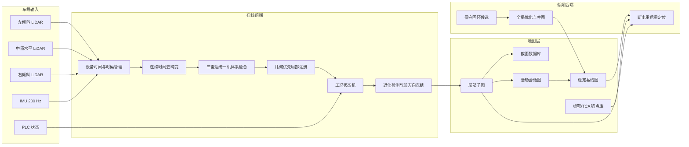
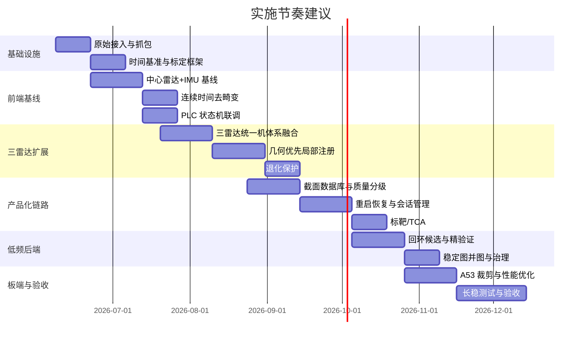

# 井下巷道三激光雷达加 IMU 建图方案深度研究与实施计划

## 总体判断

基于你最新补充的条件，我认为**已经没有阻断性疑问，可以直接进入开发实施**。但要把方案从“能讨论”变成“能落地”，必须一次性冻结四个原则：**设备时间而不是 ROS 时间是融合主时钟；主链路采用增强型松耦合而不是全时全量紧耦合；在线前端与离线后端分层部署；截面质量与长度误差分别验收**。这个判断并不是保守，而是与你的真实工况高度匹配：设备一天内大部分时间静止、车体振动很强、真正移动时间短、巷道几何又存在长直和重复结构，这种场景的主矛盾首先是“不要在静止时写出假位姿”，其次才是“怎样把少量真实运动段用好”。GUJ120 的时间与网络输出能力、SIRIUS-F002SP 的 PPS/EVENTMARK/快速恢复能力，为规范的 LiDAR–IMU 融合提供了硬件基础；而 BIEVR-LIO、SLICT、X-ICP、SuperLoc、ROLL 和 SLAM2REF 等工作则分别说明，巷道/隧道类退化环境的关键在于细粒度几何利用、连续时间建模、退化方向保护和多会话地图治理。fileciteturn0file5 fileciteturn0file3 fileciteturn0file4 citeturn2academia0turn6academia1turn6academia0turn6academia2turn7academia0

你关心的“截面质量优先”与“长度不能乱飞”并不冲突，但它们**不能由同一条未经分层的地图链路直接保障**。更合理的工程定义是：在线系统以局部高质量截面和局部几何一致性为主目标，同时用退化方向约束、状态机、重启锚定和低频全局治理来把长度误差控制在可接受范围，而不是要求单一前端里程计同时把两件事都做到极致。BIEVR-LIO 在直隧道、矿山隧道和地铁隧道类数据上的结果显示，利用细粒度几何确实能显著提升退化环境中的鲁棒性；但该工作也明确指出，低分辨率传感器和不足的点密度会限制其效果，且系统本身不负责动态建模和强度增强。对你的系统来说，这恰好意味着：**三雷达是必须的，静止段积累是必须的，状态机和活动区治理也是必须的。** fileciteturn0file4 citeturn0academia0turn7academia1turn16academia3

从硬件侧看，你当前传感器组合是“能做成”的，而不是“先天不足”。GUJ120 是 16 线机械旋转 LiDAR，支持 5/10/20 Hz、单/双回波、UDP/IP、PTP 时间源，并在 DIFOP 中包含电机锁相相位等多雷达协同相关信息；SIRIUS-F002SP 具备 PPS 输出、EVENTMARK 输入、0.01°/h 量级的陀螺零偏稳定性和 ≤10 s 快速恢复时间。与此同时，IMU 说明书也明确强调安装底板平面度、厚度和刚性，并把“工作动态过大”列为误差增大的原因之一；这说明你场景里的强振动并不是一个小问题，而是主问题。fileciteturn0file5 fileciteturn0file3

如果从截面采样密度来直观判断为什么“三雷达 + 静止段累积”是必须的，结论也很清楚。GUJ120 在 10 Hz 时水平角分辨率约为 0.18°；这意味着在 5 m 半径处，单圈水平弧长采样间隔约为 15.7 mm，在 10 m 半径处约为 31.4 mm。这个水平分辨率对截面边界是有帮助的；但它的垂直角分辨率是 2°，在 3 m 处相邻线间距约 10.5 cm，在 5 m 处约 17.5 cm，单台 16 线 LiDAR 在垂向上其实很稀疏。因此，想把截面做得好，不能依赖“单帧单雷达直接切一刀”，而要依赖**三视角互补、静止段高置信累积、以及严格的时空一致性**。这也与 BIEVR-LIO 对“点密度足够才有利于细粒度几何建模”的限制描述一致。fileciteturn0file5 citeturn21calculator0turn21calculator1turn22calculator0turn22calculator1turn0academia0

| 关键事项 | 结论 |
|---|---|
| 是否还有阻断性疑问 | 没有，可以启动开发 |
| IMU 主耦合方式 | 选增强型松耦合，非全时全量紧耦合 |
| 长度误差控制 | 通过退化约束、状态机、会话锚定和稀疏锚点来控，不放任漂移 |
| 板端部署策略 | 在线只跑前端、状态机、截面链路和重启恢复；全局优化优先离线或低频 |
| 标靶策略 | 不是必选项，但建议在重启热点、长直低特征段和控制截面区稀疏布设 |
| ROS1 的角色 | 做消息与工程集成，不做融合主时钟 |

## IMU 融合策略选择

你提出的第一个核心问题是：**IMU 应该紧耦合还是松耦合。** 如果只做教科书式回答，两者各有优劣；但放到你这个井下掘进机场景，答案就不会是中性的。LIO-SAM、FAST-LIO2、LIO-GVM 这类系统代表了典型的**紧耦合**路线，它们把 LiDAR 与 IMU 残差放进同一个优化或滤波框架，用因子图或迭代 EKF 直接融合，优势是短时动态先验更强、偏置估计更完整、在短时间退化和较激烈运动时通常更加稳定；FAST-LIO2 还通过直接使用原始点和 ikd-Tree 提高了鲁棒性与效率，LIO-SAM 则通过图优化把 IMU 偏置和里程计/回环/GPS 等因素统一管理。citeturn2academia1turn12academia0turn17academia2turn8view0turn9view1

与之相对，BIEVR-LIO、DLIO 等工作代表了更偏**松耦合或几何优先**的路线：IMU 主要负责点级去畸变、扫描间初值和偏置/重力估计，而位姿本身主要由几何注册决定。BIEVR-LIO 的论证对你非常关键，因为它明确指出，在**扩展的低结构场景**里，惯性残差有时会压过那些虽然微弱、但其实很有用的几何细节，因此它刻意让姿态增量来自几何注册，而把 IMU 作用限制为去畸变、初值和窗口中的速度/重力/偏置优化。DLIO 则说明连续时间运动校正和轻量结构有助于降低复杂度并改善映射质量。fileciteturn0file4 citeturn0academia0turn12academia1

对你的项目来说，**全时全量紧耦合不是最优主线**，原因有四个。第一，你的主工况不是高速移动，而是**长时间静止但强振动**；这类工况最怕的是 IMU 噪声、安装微弹性和时间误差被优化器“解释”为位姿。第二，你的环境是长直、重复、细微几何很重要的巷道，BIEVR-LIO 这类工作恰恰说明，微弱几何在这里非常值钱，而全时强惯性约束未必总是有利。第三，你有三台 LiDAR，却没有具备硬件时间同步能力的交换机，这意味着**异步、多时基、多外参**是天然工程负担；连续时间多雷达前端要先把点放到对的时间上，再谈统一优化。第四，你的板端计算平台是 A53 级别，虽然 FAST-LIO README 明确写到其支持 ARM 平台和外部 IMU，但那不等于“三雷达连续时间前端 + 紧耦合滑窗 + 回环 + 多会话并图”可以在同一块板上轻松实时跑满。citeturn0academia0turn2academia0turn15academia1turn8view0

但反过来说，**纯松耦合也不够**。因为你又明确补充了第二个关键要求：截面质量优先，并不意味着长度可以乱飞。长直巷道的纵向约束是弱的，X-ICP 和 SuperLoc 都明确说明，在走廊、隧道、洞穴这类局部可观测性差的环境中，系统必须显式识别退化方向，并对弱约束方向采取受控更新或冻结，否则即使局部配准看起来“能跑”，长度也会慢慢漂。ROLL 和 SLAM2REF 则进一步说明，长期系统要靠临时地图、会话锚定和可靠性门控来抑制随时间积累的偏差。换句话说，**你不需要让 IMU 在主估计里压过几何，但你必须有别的方法限制纵向发散。** citeturn6academia1turn6academia0turn6academia2turn7academia0

因此，如果必须在“紧耦合”和“松耦合”之间作单选，我的建议是：

**主系统选择增强型松耦合。**

这里的“增强型松耦合”不是把 IMU 降格成可有可无，而是采用如下结构：**IMU 负责点级连续时间去畸变、短时初值、偏置与重力估计、状态健康监测；三雷达融合后的几何注册主导位姿更新；在局部可观测性差的方向上执行退化冻结/限幅；在低频后端再用因子图或窗口优化维护会话一致性与偏置健康。** 这本质上更接近 BIEVR-LIO 的“几何优先”思想，但又借鉴了 LIO-SAM 和 FAST-LIO2 的工程经验，不会把系统做成“只有几何没有惯性”的脆弱架构。fileciteturn0file4 citeturn0academia0turn2academia1turn12academia0

| 维度 | 紧耦合 | 松耦合 | 对本项目的实际意义 |
|---|---|---|---|
| 短时激烈运动 | 更强 | 较强，但依赖更好的几何初值 | 你的移动时间短，不是第一矛盾 |
| 长直弱几何场景中保留细微几何 | 有时会被惯性残差压制 | 更容易让几何主导 | 这是你的第一矛盾 |
| 多雷达异步与时偏处理复杂度 | 更高 | 相对更容易做连续时间前端 | 三雷达系统更适合后者 |
| 对时钟误差、外参误差的敏感性 | 更高 | 仍敏感，但容错性更好 | 无硬件同步交换机时更现实 |
| 算力与调参负担 | 更高 | 更可控 | A53 平台应保守 |
| 控制长度误差的天然能力 | 更强 | 较弱 | 需要额外的退化约束与锚定机制 |

IMU 频率方面，你给出的 **200 Hz** 处于“能用、但并不奢侈”的区间。LIO-SAM README 明确建议 IMU 至少达到 200 Hz，且频率越高越有利于精度；但最新的振动感知 LIO 工作也说明，在高频强振动下，有限 IMU 采样频率和不可预知噪声会显著放大去畸变误差。因此，对你来说，200 Hz 可以支撑一期开发，但必须和**共刚体安装、振动状态机、点后不确定度降权**一起使用，不能把“200 Hz”当成振动问题已经解决。citeturn9view2turn14academia0

你补充的长度约束，建议不要模糊表达成“可接受”，而应在项目启动时直接分阶段冻结为目标。我的建议是：**Alpha 阶段**先把“静止不漂、截面稳定、重启可续建”做出来，并把 100 m 控制区相对长度误差压到 1% 以内；**Beta 阶段**在无标靶稳定区压到 0.5% 以内；**Release 阶段**在重启热点和低特征段引入 TCA 稀疏锚点后，把关键控制区压到 0.3% 左右，同时保持高等级截面质量。这个目标值是工程验收建议，不是文献现成结论，但它与当前硬件、环境和算法路线是匹配的。

## 修正后的总体技术路线

我建议把最终系统定义成**双链路 + 四类地图 + 一套状态机**。双链路指的是：一条在线运行的**局部状态估计与截面生产链路**，目标是稳定、保守、实时；一条低频或离线运行的**会话治理与全局一致性链路**，目标是长期维护、续建和全局质量。四类地图指：**局部子图、稳定基线图、活动会话图、截面数据库**。状态机则把 PLC 工况、IMU 振动和 LiDAR 几何位移统一起来，彻底防止“车没动但地图在长”。这种分层与 ROLL、SLAM2REF 的长期运行思想一致，也与 LAMP 在地下重复环境中强调的“保守闭环、抗错环”原则一致。citeturn6academia2turn7academia0turn16academia3

**时间基准**必须修正为“设备时间主导，ROS1 只负责消息总线和工程集成”。GUJ120 的原始 MSOP 包里有时间戳、Azimuth、通道和回波模式信息，且手册明确说明每个 block 里的其他测量角度需要按等间隔插值计算；LIO-SAM README 也明确要求点云具备**每点相对时间**和 **ring 编号**，并指出在 10 Hz 机械雷达下，点时间应覆盖 0 到 0.1 s。Linux 内核时间戳文档还区分了由**网卡生成的硬件接收时间戳**与由驱动/内核栈生成的软件时间戳。因此，系统不应再把 ROS 到达时间当成主时钟，而应尽可能在原始包层保留设备时间；如果 IPC 网卡支持 `SOF_TIMESTAMPING_RX_HARDWARE`，优先用网卡硬件接收时戳辅助抓包诊断；不支持时则退化到软件时戳，但在线估计仍要靠**时间偏移标定 + 连续时间轨迹**。fileciteturn0file5 citeturn9view2turn11view0turn2academia3turn3academia0turn15academia1

在多雷达处理上，我建议把**中心水平雷达**定义为全系统的 LiDAR 参考帧，左右倾斜雷达只作为补盲和增密来源，而不是三个雷达地位完全对等地同时自由漂移。离线阶段，用 LI-Init / iKalibr / OA-LICalib 一类思路完成 IMU–中心雷达时空初始化，以及左右雷达到中心雷达的外参与固定时偏估计；在线阶段不做大自由度外参联估，只做健康监测与小范围告警。多雷达异步文献说明，不需要强行假设三台雷达严格同步，但必须把** inter-LiDAR 时间差与点级不确定度**纳入建模，否则三雷达不会“变强”，只会“变脏”。citeturn2academia3turn3academia0turn15academia2turn15academia1

前端配准建议采用**连续时间多雷达几何前端**，并以**几何优先的高分辨率局部表示**为主，不把强度分支放在一期主干。SLICT 明确支持 multi-input 与 continuous-time；BIEVR-LIO 明确证明了在直隧道、矿山隧道和地铁隧道这类弱几何环境中，细粒度几何与面向信息区域的采样策略能显著提高鲁棒性；而 COIN-LIO 和 ISC 则说明强度在几何严格退化时有重要价值。因此，推荐的一期策略是：**先做 BIEVR 思想的几何优先前端和 X-ICP/SuperLoc 式退化保护；若现场验证表明长直极低特征段仍达不到长度目标，再把强度残差作为条件激活增强项引入。** 这样做的好处是先解决主矛盾，不把系统在一期就做成多模态复杂体。fileciteturn0file4 citeturn2academia0turn0academia0turn6academia1turn6academia0turn7academia1turn13academia0

PLC 状态机必须至少做成八态：`IDLE_STATIC`、`CUTTING_STATIC`、`FWD_MOVE`、`REV_MOVE`、`TURNING`、`CMD_MOVE_NO_DISP`、`CONFLICT`、`RELOCALIZING`。这里最重要的不是命名，而是控制地图写入权限：**静止待机**允许高置信静态累积与截面精化，**静止截割**允许锁定位姿下的鲁棒低权重累积，**指令运动但未位移**禁止扩图，**状态冲突**只写活动会话图不进稳定图。你提供的 PLC 延迟已是毫秒级，这当然是好消息，但它仍然只应作为工况门控，不能替代位移传感器。citeturn14academia0turn6academia1turn6academia0

标靶与锚点策略建议继续采用**单标靶 + 上下文锚点**，而不是回退到“单柱本体必然唯一”的设想。Pole-Image 和多篇 pole landmark 长期定位工作都说明：杆状/柱状物好检测、长期稳定，但其**可检测性高不等于可区分性高**；真正稳妥的做法是用“高可检测锚点 + 周边 3–8 m 局部几何/强度/截面上下文”共同定义身份。因此，工程上应把单标靶视为 TCA 的入口，而不是 TCA 的全部。你的标靶布设可以很稀疏，但应优先覆盖**断电热点、长直低特征段、岔口/转折、控制截面区**。citeturn23academia0turn23academia1turn23academia2turn23academia3

断电后续建的重启流程，建议按“**近场优先、由轻到重**”来定。SIRIUS-F002SP 说明书给出快速恢复 ≤10 s，GUJ120 上电即自动发数，因此最佳上电顺序应是：**先让工控机、日志与 PLC 驱动就绪，再给 IMU 和 LiDAR 上电，再留 10–15 s 做 IMU 快速恢复与静态窗口，之后先尝试‘最后稳定位姿 + 最近局部子图’的一级重定位；失败后再走 TCA；再失败才进入 Scan Context++/ISC 的全局候选。** 这样做能最大化利用“原地重启”这个对算法非常友好的条件。fileciteturn0file3 fileciteturn0file5 citeturn2academia2turn13academia0

从工程容量来看，**存储和算力必须做分层**。GUJ120 手册给出 MSOP 包 1248 bytes、发送间隔约 0.6 ms；按这个量级估算，单雷达仅 MSOP 负载就约 7.49 GB/h，三雷达约 22.46 GB/h，按 23 h 运行则约 516.67 GB/天。这还没算 rosbag、DIFOP、PLC 和诊断日志。也就是说，你当前 32 GB 板载存储在开发阶段绝对不够做全量原始包留存，生产阶段也不适合长时连续全量录制。因此，**开发阶段必须外接 SSD 或网络落盘；生产阶段采用滚动缓存 + 事件保全 + 周期性快照**。fileciteturn0file5 citeturn18calculator1turn18calculator2turn18calculator3

代码复用上，一期最现实的组合是：**FAST-LIO2 作为单雷达紧耦合回归基线，LIO-SAM 作为 ROS1 因子图后端参考，SLICT/noetic 作为多雷达连续时间前端参考，Scan Context++ 与 ISC 作为回环候选模块，RTAB-Map 作为离线可视化与工具链辅助**。FAST-LIO README 明确支持原始点直接配准、外部 IMU 和 ARM 平台；LIO-SAM README 明确它是原始 ROS1 实现；SLICT 仓库保留了 ROS1 Noetic tag；Scan Context 官方仓库明确给出与 LIO-SAM 和 FAST-LIO2 的集成示例；RTAB-Map 仓库则显示 ROS1 Noetic 二进制仍可用。citeturn8view0turn9view1turn9view4turn9view5turn19view0

## 开发任务分解

下面的任务分解按**功能模块**而不是按“论文名”组织。这样做的好处是责任边界清楚，后续真正落地时不会出现“算法能跑，但系统没人兜底”的问题。协作角色建议固定为五类：**FE** 负责前端建图与状态估计，**BE** 负责地图/重启/后端治理，**SYS** 负责驱动/时钟/存储/PLC/部署，**QA** 负责数据采集与评测，**ME** 负责机械安装、减振与标靶施工。

| 模块 | 目标 | 开发内容 | 输入输出接口 | 依赖 | 实施步骤 | 优先级 | 主责与边界 | 交付物 | 验收标准 |
|---|---|---|---|---|---|---|---|---|---|
| 时间同步与原始数据接入 | 建立统一时间基准，保留可追溯原始数据 | MSOP/DIFOP 解包、IMU 驱动、PLC Modbus/TCP 驱动、原始包录制、设备时间与系统时间映射 | 输入：三雷达 UDP、IMU 串口/422、PLC TCP；输出：原始 topic、packet log、时间状态 topic | 无 | 先完成原始抓包与 topic 化，再做基于包时间的时间映射，最后加运行期健康监测 | P0 | SYS 主责；QA 提供联调数据；FE 只消费标准化数据 | 驱动包、抓包工具、时间健康监测页 | 静态运行 2 h 无丢包、无时间回退；日志可完整回放 |
| 外参与时间偏移标定 | 冻结三雷达—IMU 时空参数 | 中心雷达参考系冻结、左右雷达到中心雷达外参审计、LiDAR–IMU 时偏初始化、标定 YAML 版本化 | 输入：原始包、静态/动态标定数据；输出：标定文件、健康状态 | 时间接入模块 | 先离线精标，再做在线健康监测，不在运行时自由联估大外参 | P0 | FE + SYS 主责；ME 负责安装登记；QA 负责复测 | `extrinsics.yaml`、标定报告、TF 审计脚本 | 多次上电静态叠加无系统双边；安装后复测误差在阈内 |
| 连续时间去畸变与预处理 | 输出可注册的高质量点云 | 点级时间插值、IMU 轨迹插值、粉尘/飞散物过滤、近场动态过滤、每点质量权重 | 输入：原始 packet、IMU、时偏；输出：deskew 后点云、质量标签 | 时间接入与标定 | 先做单雷达中心基线，再扩到三雷达统一去畸变 | P0 | FE 主责；SYS 提供解包字段 | 预处理节点、参数集、回放脚本 | 静止待机/静止截割不出现明显虚影；去畸变后局部边缘更清晰 |
| 三雷达融合与几何前端 | 建立主里程计与局部子图 | 三雷达投到机体系、重叠区一致性检验、几何优先局部注册、信息区域采样 | 输入：deskew 点云；输出：局部位姿、融合点云、注册残差 | 标定、预处理 | 先中心雷达单机前端，再上线左右雷达，最后做密度/遮挡权重 | P0 | FE 主责；BE 不干预前端状态 | 前端节点、残差监控、回归报告 | 100 m 控制区内轨迹连续；静态叠加边缘无持续双线 |
| IMU 增强松耦合状态估计 | 用 IMU 做去畸变、短时预测和偏置管理 | IMU 预积分、连续时间轨迹、滑窗偏置/重力估计、前端初值预测 | 输入：IMU、前端关键位姿；输出：状态先验、偏置、重力方向 | 时间接入、前端 | 先做 bias/gravity 稳定，再联前端，用于 deskew 与 prior，不直接主导 pose | P0 | FE 主责；QA 负责振动数据集 | 状态估计节点、bias 报告 | 静止段偏置稳定；移动段 prior 能显著提高收敛率 |
| PLC 状态机与策略切换 | 消灭静止假位移，约束地图写入 | 左右履带译码、截割电机译码、八态状态机、冲突与空转检测、策略门控 | 输入：PLC、IMU 振动、前端位移；输出：机器状态、地图写入模式 | 时间接入、前端、IMU | 先做离线状态回放，再上线实时门控，最后加告警与滞回 | P0 | SYS+FE 主责；QA 做冲突场景测试 | PLC 节点、状态机节点、告警规则 | 指令运动未位移识别率 >95%；静止截割时位姿被冻结 |
| 局部子图与截面数据库 | 以截面质量优先组织成果 | 控制链距切片、局部聚合、观测截面/结构截面双产品、质量分级 A/B/C | 输入：局部位姿、融合点云、机器状态；输出：子图、截面库、质量标签 | 前端、状态机 | 先做观测截面，再做结构截面剔除与质量分级 | P0 | BE 主责；FE 提供位姿；QA 定义控制断面 | 截面导出器、截面数据库、QA 对比工具 | 控制截面重复采样一致；静止待机截面优于运动截面 |
| 断电恢复与多会话管理 | 支持原地重启续建且不污染基线图 | 日志式快照、最后稳定位姿恢复、最近局部子图一级重定位、新会话暂存与晋升 | 输入：快照、局部图、当前点云；输出：恢复状态、新会话 | 局部子图模块 | 先做断点恢复，再做一级重定位，最后做会话晋升策略 | P0 | BE + SYS 主责；FE 提供精配准 | 会话管理器、恢复服务、WAL/快照格式 | 热点重启后在目标时间内恢复；失败时不污染稳定基线图 |
| 标靶与 TCA 锚点 | 在低特征段和热点提供可靠锚定 | 反光圆柱检测、上下文子图提取、TCA 建库、锚点健康检查 | 输入：融合点云、锚点配置；输出：锚点观测、候选约束 | 前端、会话管理 | 先做单标靶检测，再做 TCA 联合验证，最后接入重启流程 | P1 | FE + BE 主责；ME 负责布设；QA 负责遮挡测试 | 标靶检测器、TCA 数据库、站位台账 | 小先验范围内识别成功率高；不唯一时必须拒绝 |
| 保守回环与全局治理 | 限制错误回环，稳步改善全局一致性 | Scan Context++/ISC 候选、精验证、稳定区闭环、活动区暂不闭环 | 输入：关键帧、会话图；输出：回环因子、优化后稳定图 | 会话管理、截面库 | 先只做候选检索，再做精验证，最后做低频并图 | P1 | BE 主责；QA 提供已知 revisit 集 | 回环模块、误检审计、优化报告 | 错环率极低；闭环后控制断面不被拉坏 |
| 数据记录、回放与评测工具链 | 形成可复现研发闭环 | rosbag+packet 双录制、离线回放、指标计算、失败切片库、参数回归 | 输入：所有运行数据；输出：报表、回归结果、失败样例 | 原始接入模块 | 先打通回放，再做 nightly 回归，最后做自动对比 | P0 | SYS + QA 主责 | 数据工具链、指标面板、版本对比文档 | 任意重大失败都能一键复现与对比 |
| 板端部署与性能优化 | 让 A53 平台稳定承载在线前端 | 线程编排、零拷贝、锁优化、topic 节流、回环低频化、外存策略 | 输入：完整系统；输出：板端部署包、运维手册 | 所有核心模块 | 先在 x86 跑通，再剪裁到板端，最后做长稳与断电测试 | P0 | SYS 主责；FE/BE 配合裁剪 | 部署脚本、监控脚本、运维手册 | 10 Hz 运行不积压；24 h soak test 不崩溃 |

这套任务分解的一个核心思想是：**先把“错的东西不写进地图”做对，再追求“对的东西更精细”**。因为你的场景里，静止强振动、长直低特征、断电续建和活动工作面变化是同时存在的；如果先急着做回环、全局优化和漂亮的总图，而没有用状态机与地图分层把“错误增量”挡在外面，系统很容易表面上越来越复杂，实际上却越来越不稳定。citeturn6academia1turn6academia0turn6academia2turn16academia3

## 实施节奏与协作机制

从项目节奏上，我建议采用**先离线、后在线；先单中心雷达、后三雷达；先稳定前端、后全局治理**的路线。原因很简单：FAST-LIO2 的 README 虽然明确支持 ARM 平台，说明轻量前端上板并非不可行；但 BIEVR-LIO 的实验运行平台是 Intel i7-11800H 级别，SLICT 的多输入连续时间前端本身也更重，因此你不能把“论文里能跑”直接换算成“板端三雷达全链路可以首版实时满配”。最稳妥的做法是：**P0/P1 阶段在 x86 工具链上把原始数据、去畸变、多雷达前端、状态机和截面链路做透；P2 才把在线必需部分裁剪到 A53；P3 再决定哪些后端功能要板端低频保留，哪些永久离线。** fileciteturn0file4 citeturn8view0turn9view4

更具体地说，项目可以按下面六个阶段推进：

| 阶段 | 时间建议 | 目标 | 退出条件 |
|---|---:|---|---|
| P0 | 第 1–4 周 | 建立可回放、可追责的基础设施 | 三雷达/IMU/PLC 原始数据可同步录制并稳定回放；外参命名、坐标系、日志格式冻结 |
| P1 | 第 5–8 周 | 跑通中心雷达 + IMU 基线与状态机 | 空闲静止不漂、截割静止不扩图、前进/后退可正确切换 |
| P2 | 第 9–14 周 | 扩展到三雷达连续时间前端 | 三雷达融合后叠加稳定，局部子图和截面链路可用 |
| P3 | 第 15–18 周 | 完成重启恢复与会话管理 | 原地断电重启可通过一级局部重定位恢复；失败时可安全新建会话 |
| P4 | 第 19–22 周 | 加入 TCA 和保守回环 | 低特征段与热点恢复成功率显著提升，错回环率受控 |
| P5 | 第 23–28 周 | 板端部署、长稳与验收 | A53 在线前端稳定运行，完成现场控制断面与控制链距验收 |

协作边界上，最重要的一条是：**FE 不直接修改设备驱动和日志格式，SYS 不直接修改前端数学模型，BE 不直接入侵实时主循环**。原因在于这类系统一旦把驱动、融合、后端和部署混改，后续任何性能退化都会变成“说不清到底是谁改坏了”。因此建议每个模块都双交付：一份**运行产物**，一份**回放与指标产物**。这样任何现场失效都能被拉回实验室复现，不会变成“现场玄学”。citeturn7academia3turn19view0

## 模糊点、风险与验收口径

从“可启动开发”的角度看，你给的信息已经足够；但从“保证整个团队少走弯路”的角度看，仍有几项工程参数必须在开工初期冻结。它们不是阻断问题，但如果拖到中后期再定，代价会很高。

| 需在 P0 冻结的工程参数 | 为什么必须尽早冻结 |
|---|---|
| 网卡是否支持 RX 硬件时间戳 | 决定诊断链路能否拿到更稳定的接收时戳 |
| PLC 字段映射、轮询周期与在负载下的真实抖动 | 影响状态机滞回、冲突判断和空转识别 |
| GUJ120 实际可用的时间源/相位锁定配置 | 影响多雷达相对扫描相位与时间一致性 |
| 传感器岛机械结构是否共刚体隔振 | 决定 LiDAR–IMU 外参在强振动下是否“活了” |
| 板端存储扩展方案 | 决定开发数据是否能保真留存 |
| 控制截面与控制链距的人工基准获取方式 | 决定后续验收有没有客观依据 |

风险层面，真正高危的不是“算法不够新”，而是**静止振动假位移、时间链路不清、外参刚体失效、长直重复段纵向退化、错误重定位/错误回环、以及数据不可复现**。BIEVR-LIO、X-ICP、SuperLoc、振动感知 LIO、ROLL、SLAM2REF 与 LAMP 都从不同角度说明：在重复、退化和变化并存的环境下，系统首先要学会的是**保守地拒绝错约束**，而不是激进地吸收一切信息。fileciteturn0file4 citeturn6academia1turn6academia0turn14academia0turn6academia2turn7academia0turn16academia3

| 主要风险 | 直接后果 | 缓解措施 |
|---|---|---|
| 静止截割被误判为小位移 | 地图在 23 h 主工况下持续被写坏 | 八态状态机、位姿冻结、振动降权、活动区写图 |
| 设备时间与 ROS 时间混用 | 去畸变和多雷达融合长期发虚 | 原始包时间保留、时偏标定、连续时间建模 |
| IMU 单独软安装或安装底板刚性不足 | 振动下 LiDAR–IMU 外参失效 | 采用共刚体传感器岛，禁止单独软隔振 IMU |
| 三雷达外参方向/父子关系反用 | 截面边缘双线、重影 | TF 审计脚本、静态复核、版本化管理 |
| 长直低特征段纵向退化 | 长度误差失控 | 退化方向冻结/限幅、TCA 锚点、低频回环 |
| 断电后微位移或液压回弹 | 直接套用上次位姿导致续建失败 | 一级局部验证，不通过则进二级/三级重定位 |
| 单标靶当唯一身份 | 误配锚点，局部地图被拉坏 | 单标靶只做锚点入口，身份由 TCA 上下文决定 |
| 全局图把活动工作面直接写成稳定图 | 后续重定位成功率下降 | 稳定图/活动图区分，会话晋升而非直接并图 |
| 开发阶段无法完整留存原始数据 | 问题不可复现 | 外部 SSD，packet+topic 双录制，失败切片库 |
| 把所有后端都强行上板端 | 板端过载，实时性丢失 | 板端只保留在线必需项，重后端离线或低频运行 |

最终验收不应只看一条 ATE 曲线，而应围绕你的真实运营目标来定义。下面这套口径比较适合作为项目验收标准：

| 验收项 | 建议门槛 | 说明 |
|---|---|---|
| 空闲静止漂移 | < 1 cm/h | 在 `IDLE_STATIC` 状态下，位姿应几乎不动 |
| 静止截割漂移 | < 2 cm/h | 在 `CUTTING_STATIC` 状态下允许更宽一点，但仍要冻结轨迹 |
| 断电热点恢复成功率 | > 95% | 不加标靶热点应达到该水平 |
| 加 TCA 后热点恢复成功率 | > 98% | 稀疏锚点场景下应明显提升 |
| 控制链距相对误差 Alpha/Beta/Release | ≤1.0% / ≤0.5% / ≤0.3% | 以 100 m 控制区为基准；Release 可结合 TCA |
| A 级结构截面 | RMSE ≤ 25 mm，完整度 ≥ 90% | 主要来自静止待机段和高置信累积 |
| B 级结构截面 | RMSE ≤ 40 mm，完整度 ≥ 80% | 允许来自运动段或静止截割段 |
| 在线前端板端时延 | 平均 < 80 ms，P95 < 100 ms | 只针对在线必需模块，不含重后端 |
| 板端内存占用 | 峰值 < 6 GB | 预留系统和缓冲冗余 |
| 数据保全 | 事件回溯完整 | 任一重启、失配、错环都能导出证据链 |

最后给出一句最关键的实施判断：**你这套系统的成败，不取决于“找一篇最先进的论文直接复现”，而取决于是否把“时间、刚体、状态、地图层级和验收口径”在项目一开始就做成工程约束。** 只要这五件事先定住，增强型松耦合主链路、三雷达连续时间前端、保守会话治理和稀疏 TCA 锚点这条路线，是有很高把握做成长期稳定井下建图系统的。fileciteturn0file5 fileciteturn0file3 fileciteturn0file4 citeturn2academia0turn0academia0turn6academia1turn6academia0turn6academia2turn7academia0