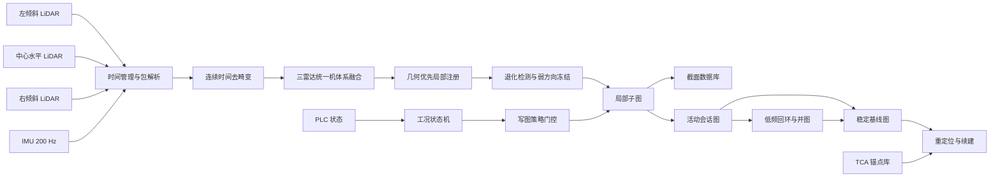
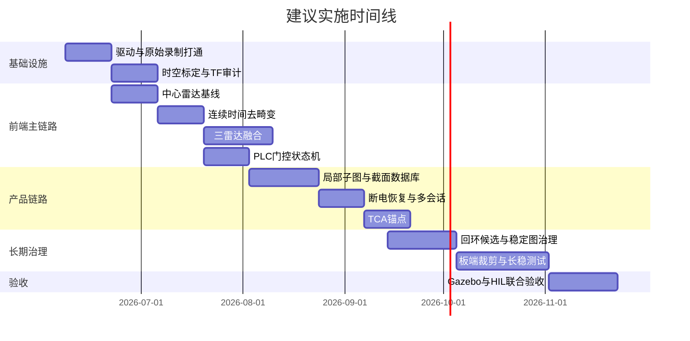

# 井下履带式掘进机三激光雷达与 IMU 长期稳定建图与断电续建实施报告

## 执行摘要

在你给定的硬件、时序和工况约束下，这个项目**可以落地**，但不能把它定义成“找一个现成单雷达 LIO 套上三台雷达”的普通集成项目，而应定义成“**增强型松耦合的连续时间多雷达 LiDAR–IMU 前端 + PLC 门控状态机 + 截面优先的数据产品链路 + 多会话断电续建后端**”的系统工程。这个判断的依据是：GUJ120 已提供机械旋转 16 线、原始 UDP 数据、PTP 时间源、单/双回波以及多雷达相关的电机锁相相位信息；SIRIUS-F002SP 提供 RS422、PPS、EVENTMARK、快速恢复，以及对安装底板平面度和刚性的明确要求；而 BIEVR-LIO、SLICT、X-ICP、SuperLoc、ROLL 和 SLAM2REF 分别证明了弱几何隧道、异步多传感器、退化方向控制及多会话地图治理在地下场景中的关键性。fileciteturn0file6 fileciteturn0file4 fileciteturn0file5 citeturn23academia0turn6academia0turn11academia1turn10academia1turn10academia3turn10academia0

针对“**截面质量优先，但长度误差也要可控**”这个核心目标，最合适的主方案不是全时全量紧耦合，而是**几何主导、IMU 增强的松耦合主链路**：IMU 负责每点去畸变、短时运动先验、偏置与重力估计；三雷达融合后的几何注册主导位姿更新；弱可观测方向由 X-ICP 或 SuperLoc 一类的退化保护策略限幅或冻结；低频后端再处理会话锚定、保守回环与地图治理。这样做的主要收益是，能尽量避免在“车体长时间静止但振动很强”的主工况下，把 IMU 噪声、时间偏差或安装微弹性误写成车体位移，同时又不放任长度漂移失控。citeturn0academia2turn0academia0turn28academia1turn23academia0turn11academia1turn10academia1

工程实现上，建议把系统拆成两条主链路。第一条是**在线运行链路**，只承担驱动、时间管理、连续时间去畸变、三雷达拼接、局部配准、PLC 状态机、截面生产和断电恢复；第二条是**低频或离线治理链路**，承担稳定图晋升、保守回环、会话合并、质量审计和结果导出。由于 ROS 1 Noetic 已于 2025-05-31 到达官方 EOL，而 Gazebo Classic 也已在 2025 年到达 EOL，本项目应**冻结在 ROS1 Noetic + Gazebo 11 的容器化工具链**上完成开发和仿真验收，而不要在项目中途迁移到 ROS 2/Gazebo 新栈；官方也明确说明，EOL 后 ROS 1 仍可继续运行，但不再获得新特性、安全更新和官方 bugfix。citeturn30view0turn29view2turn16view0

从资源角度，这个方案也必须做“**板端在线最小化，后端低频化**”设计。FAST-LIO2 官方仓库明确说明其支持外部 IMU、支持 ARM 平台，并能直接在原始点云上做 scan-to-map；但 BIEVR-LIO 的论文实验平台是 Intel i7-11800H 级别，SLICT 也是连续时间多输入系统。因此，一期上线不应试图在 A53 板端实时常驻“三雷达连续时间前端 + 高开销全局优化 + 密集回环 + 全局重建”，而应把板端任务严格收敛到在线必需部分，把会话治理与重建工具链移到低频或离线侧。citeturn29view3turn29view5 fileciteturn0file5

建议冻结的阶段性验收目标如下：控制区内**静止阶段不漂移**；控制断面重复观测的**轮廓一致性**优先验收；100 m 控制区相对长度误差在无标靶情况下先压到 **1%** 以内，在参数收敛与退化保护上线后压到 **0.5%** 以内，在重启热点或低特征段配置稀疏 TCA 锚点后压到 **0.3%–0.5%** 的控制区间；断电后在传感器恢复稳定后 **45 s** 内，要么恢复到可信续建状态，要么进入安全的新会话暂存状态，绝不允许“错误恢复后继续写坏基线图”。这些数值不是文献给出的现成结论，而是结合你的硬件、工况和算法路线做出的工程目标建议。

## 已知条件与默认假设

已明确的输入条件已经足够启动实施：三台 GUJ120 均为 10 Hz、单回波；中心雷达水平居中，左右雷达倾斜安装，且已给出两组外参矩阵；IMU 为 200 Hz；PLC 通过 Modbus TCP 502 轮询，可给出左履带、右履带和截割电机状态；巷道可能为矩形或拱形，且存在管线、电缆、支护网和锚杆；允许按可行性稀疏部署圆柱反光标靶；断电后为原地重启；以截面质量为首目标，同时要求长度误差可控。这些条件决定了系统必须把“**静止与振动**”当成主问题，而不是把“高速运动”当成主问题。

仍建议在项目开始的 P0 阶段明确冻结下表中的默认假设。表中凡标为“需确认”的项，不是阻断开发的问题，但如果不尽快固定，后续会持续制造返工。

| 项目 | 建议假设 | 说明 |
|---|---|---|
| 外参矩阵方向语义 | 统一在代码中固定为“以中心雷达为 LiDAR 主参考系”，左右矩阵在入库时一次性规范为 `T_center_left` 与 `T_center_right` | 你给出的 YAML 名称与静态 TF 例子存在方向歧义，这一项必须在 P0 被彻底消灭 |
| IMU 参考系适配 | 建立显式 `imu_native -> imu_ros -> lidar_center` 两级变换 | IMU 手册写明机体定义为 Y 向前、Z 向上、X 向横向，而许多 ROS/LIO 组件默认采用 REP-105 风格的 x-forward / y-left / z-up；不做显式适配，后期必出错。fileciteturn0file4 citeturn22view2 |
| IMU 接口形态 | 默认 IMU 通过 RS422 直连 IPC，PPS 输出接 IPC 可捕获的时序输入 | IMU 手册列出了 RS422、PPS、EVENTMARK，而不是以太网接口，因此时间链路设计应以“IMU 直连 + PPS 抓边”为优先。fileciteturn0file4 |
| LiDAR 时间管理 | 不把交换机无硬同步能力视为“PTP 完全不可用”，但也不把网络对时当作最终精度保证 | 以 GUJ120 设备时间和点级时间重建为主，PTP 只作为可选辅助。fileciteturn0file6 citeturn4view6turn4view7 |
| 断电后微位移 | 允许底盘因液压回弹产生小幅位姿变化，但默认不超过 0.2 m / 2° | 若超过这一量级，一级“最后稳定位姿”恢复应直接放弃，切换到锚点或全局候选 |
| 车载存储 | 开发阶段默认外接 SSD；生产阶段只保留滚动原始缓存与压缩成果 | 三雷达原始 UDP 数据长期全量留存对 128 GB 上限存储不现实。fileciteturn0file6 citeturn24calculator2turn24calculator3 |
| 截面产品定义 | 同时产出“观测截面”和“结构截面” | 观测截面保留管线/网/锚杆；结构截面按配置剔除附属设施并允许矩形/拱形先验 |
| 标靶使用原则 | 单个圆柱标靶不是全局唯一 ID，而是 TCA 入口 | 身份由“标靶中心 + 周边 3–8 m 上下文 + 历史位姿先验”共同确定。citeturn14academia0turn14academia1turn14academia2turn14academia3 |

需要特别指出的是，GUJ120 的原始 MSOP 包本身已经包含对点级时间恢复至关重要的字段：包长固定 1248 bytes，含 12 个 block、Azimuth、通道顺序、尾部 Timestamp 和 Factory 字段，且手册明确说明同一 block 内其余点的角度要通过等间隔插值计算。LIO-SAM 的官方 README 也明确要求机械式 LiDAR 必须提供**每点相对时间**和 **ring 编号**，并指出在 10 Hz 下，相对时间应覆盖 0 到 0.1 s。换言之，驱动层绝不能只输出“已经拼好的普通 PointCloud2”，而必须保留点级 `time/ring/sensor_id` 语义。fileciteturn0file6 citeturn22view0turn22view1

## 总体方案与关键技术决策

推荐的系统形态是“**局部前端强约束，长期后端保守治理**”。在线链路采用中心雷达为参考时刻与参考坐标系，左右雷达作为补盲与增密输入；三雷达的每个点先在各自时刻完成点级去畸变，再通过外参与时间偏移补偿统一到中心雷达的融合时刻；融合后的点云进入几何优先的局部地图注册，注册输出再经 PLC 状态机、退化检测和写图门控，最终同时写入局部子图与截面数据库。低频后端则维护稳定基线图、活动会话图、TCA 锚点库与回环候选，负责断电续建和长期一致性。ROLL 与 SLAM2REF 的核心经验正是：**在长期变化场景中，先允许临时会话存在，再在可靠匹配恢复后谨慎合并，而不是立刻把所有新观测写死进基线图。** citeturn10academia3turn10academia0

关于 IMU 紧耦合与松耦合，建议给团队一个很明确的结论：**主系统选增强型松耦合，而不是全时全量紧耦合。** LIO-SAM 和 FAST-LIO2 代表典型紧耦合路线，前者将 LiDAR–IMU 融合放进因子图，后者用紧耦合 iEKF 直接在原始点云上做 scan-to-map；它们在短时激烈运动、偏置估计和运动先验上有明显优势。BIEVR-LIO 与 DLIO 则代表几何优先、去畸变和连续时间友好的路线，它们更强调把 IMU 用于点级运动补偿和初值，而不是让惯性残差在弱几何环境中主导位姿。citeturn0academia2turn0academia0turn28academia1turn23academia0

| 维度 | 紧耦合主链路 | 增强型松耦合主链路 | 对本项目的实际影响 |
|---|---|---|---|
| 对短时动态的支撑 | 强 | 中到强 | 你的真实移动时间短，这不是第一矛盾 |
| 对静止强振动的容错 | 容易把时偏、安装弹性和噪声一起“解释”为位姿 | 更容易把位姿更新留给几何注册与门控逻辑 | 这是你的第一矛盾 |
| 对细微巷道几何的保留 | 可能被强惯性残差压制 | 更容易让细粒度几何主导 | 有利于截面边缘与局部形状 |
| 对长度误差天然约束 | 更强 | 较弱 | 需用退化保护、锚点和会话治理弥补 |
| 多雷达异步集成复杂度 | 更高 | 相对可控 | 三雷达系统更适合后者 |
| 算力与调参与板端负担 | 更高 | 更可控 | A53 平台更适合后者 |

最终推荐的落地形式不是“纯松耦合”，而是**IMU 增强松耦合**：IMU 负责每点去畸变、预测初值、滑窗 bias/gravity 管理和健康监测；位姿本身主要由 LiDAR–map 配准决定；一旦检测到弱可观测方向，就执行 X-ICP 或 SuperLoc 风格的局部可观测性保护；低频后端再利用 ROLL/SLAM2REF 风格的会话锚定与多会话地图治理压制长度飘移。这样做对“截面质量”和“长度可控”的平衡最好。citeturn11academia1turn10academia1turn10academia3turn10academia0

局部地图表示上，建议采用“**轻量基线 + 高分辨率增强接口**”的路线，而不是首版就完整复刻某一篇论文。BIEVR-LIO 证明了高分辨率面内起伏表示在直隧道和矿山隧道中的价值；COIN-LIO 证明了强度在几何严格退化场景中可以补充几何；SLICT 证明了连续时间多输入架构可以原生容纳多 LiDAR。基于 A53 资源约束，更稳妥的实现路径是：**首版前端先做多分辨率 surfel/voxel 注册 + 连续时间去畸变 + 退化冻结；同时预留 BIEVR 风格 patch residual 和强度增强接口，作为 P1/P2 增强项逐步上线。** citeturn23academia0turn18academia0turn6academia0

对标靶策略的结论也应非常明确：**圆柱标靶是强检测锚点，不是单体唯一编码器。** Pole-Image、DRIP 以及基于杆状地标的长期 LiDAR 定位研究都说明，杆状物的价值首先在于“容易稳定检测”，而不是“单看一根柱体就能唯一识别”。因此，本项目中的圆柱反光标靶应统一建模为 **TCA**：`Target-Context Anchor`，也就是“标靶中心 + 周边局部几何/强度/截面上下文 + 历史位姿先验”的联合锚点。citeturn14academia0turn14academia1turn14academia2turn14academia3

最后还有一个必须写进总方案的现实决策：**本项目继续使用 ROS1，但把 ROS1 明确定义为“工程总线与工具链”，而不是“融合主时钟”或“长期生态演进目标”。** 官方已经说明 ROS 1 Noetic 和 Gazebo Classic 都已 EOL；但同样也说明 EOL 不等于立刻不能运行，二进制仍会继续托管，现有系统仍能工作。因此，本项目最优策略不是临时迁移，而是**冻结一套可复现的 Noetic/Gazebo11 容器环境，严禁中途换栈**。citeturn30view0turn29view2

## 模块化开发任务分解

为避免“算法和系统互相踩边界”，建议团队角色固定为五类：**SYS** 负责驱动、时间、PLC、存储与部署；**FE** 负责前端里程计、去畸变、状态估计和退化保护；**BE** 负责会话管理、断电恢复、回环和地图治理；**QA** 负责数据采集、仿真、指标与回归；**ME** 负责机械安装、刚性、减振和标靶施工。

统一接口建议先冻结如下。GUJ120 默认 MSOP/DIFOP 端口为 2368/8603，采用 UDP/IP；IMU 通过 RS422 输出，并提供 PPS 与 EVENTMARK；PLC 通过 Modbus TCP 502 进入系统。fileciteturn0file6 fileciteturn0file4

| 接口 | 生产者 | 传输 | 主题或端口 | 消息格式 | 关键字段 |
|---|---|---|---|---|---|
| 三雷达原始包 | GUJ120 ×3 | UDP | `2368` / `8603` | `guj120_msgs/PacketBurst` | `sensor_id, host_rx_ns, device_ts_us, packets[], difop` |
| 三雷达原始点 | 解包器 | ROS1 | `/sensors/guj120/{center,left,right}/points_raw` | `sensor_msgs/PointCloud2` | `x,y,z,intensity,ring,time,return_type,sensor_id` |
| IMU 原始数据 | IMU 驱动 | RS422 -> ROS1 | `/sensors/imu/raw` | `lio_msgs/ImuRawEx` | `hw_stamp_ns, ax,ay,az,gx,gy,gz,pps_seq` |
| PPS 事件 | 时序节点 | GPIO/串口事件 -> ROS1 | `/time/pps_event` | `lio_msgs/PpsEvent` | `stamp_ns, source, seq` |
| PLC 状态 | Modbus 客户端 | TCP 502 -> ROS1 | `/machine/plc_state` | `machine_msgs/PlcState` | `left_track, right_track, cutter, poll_latency_ms, valid` |
| 去畸变融合点云 | 前处理节点 | ROS1 | `/lio/points_deskewed` | `sensor_msgs/PointCloud2` | `x,y,z,intensity,ring,time,sensor_id,weight` |
| 预测状态 | IMU 滑窗 | ROS1 | `/lio/state_predict` | `lio_msgs/StatePredict` | `pose, vel, ba, bg, gravity, score` |
| 局部里程计 | 局部注册 | ROS1 | `/lio/odom_local` | `nav_msgs/Odometry` | `pose, twist, cov, degeneracy_mode` |
| 工况状态 | 状态机 | ROS1 | `/machine/state` | `machine_msgs/MachineState` | `mode, trusted_motion, write_policy, conflict_code` |
| 地图与截面 | 地图管理器 | ROS1 | `/map/local_submap`, `/map/session`, `/map/stable`, `/section/observed`, `/section/structural` | `PointCloud2` 或自定义元数据消息 | `session_id, chainage, quality, source_mode` |
| 服务接口 | 恢复/导出模块 | ROS1 service | `/session/recover`, `/session/snapshot`, `/section/export`, `/tca/register` | 自定义 srv | `request_id, session_id, result, diagnostics` |

下面给出按模块组织的任务分解。为了让表格真正可执行，每个模块都给出目标、开发内容、输入输出、依赖关系、实施步骤、优先级、协作边界、交付物与验收标准。

| 模块 | 目标 | 开发内容 | 输入与输出接口 | 依赖 | 实施步骤 | 优先级 | 负责人边界 | 交付物 | 验收标准 |
|---|---|---|---|---|---|---|---|---|---|
| 时间与原始数据接入 | 建立统一、可追责的原始数据链路 | GUJ120 MSOP/DIFOP 解包；IMU RS422 驱动；PPS 捕获；Modbus TCP 客户端；PCAP 与 rosbag 双录制 | 输入：UDP 2368/8603、RS422、TCP 502；输出：`/sensors/*`、`/time/pps_event`、PCAP | 无 | 先抓包，再解包，再做诊断与回放 | P0 | SYS 主责；FE 不改包格式 | 驱动包、抓包工具、回放脚本 | 连续 2 h 无时间回退；丢包率满足阈值；录制可一键回放 |
| 时空标定与 TF 审计 | 冻结三雷达与 IMU 时空关系 | 外参入库规范；中心雷达主参考系；IMU 参考系适配；LiDAR–IMU 固定时偏初始化；在线健康监测 | 输入：原始数据、静态墙面数据、激励数据；输出：`calib/*.yaml`, `/tf_static` | 时间接入 | 先离线精标，再做自动审计，再启用在线告警 | P0 | FE+SYS 主责；ME 仅负责安装与复测 | 标定文件、审计工具、复测报告 | 三雷达静态叠加无系统双线；外参方向歧义被消除 |
| 连续时间去畸变与预处理 | 输出可用于注册的高质量点云 | 基于包时间与点内插值恢复点时刻；IMU 连续轨迹插值；近机体动态区遮蔽；粉尘/飞散物滤波；点级权重赋值 | 输入：`/sensors/guj120/*`, `/sensors/imu/raw`；输出：`/lio/points_deskewed` | 标定、时间管理 | 先做中心雷达，再扩展左右雷达，再接动态过滤 | P0 | FE 主责；SYS 提供原始字段 | 去畸变节点、参数模板、回放报告 | 静止待机和静止截割场景下，局部边缘显著优于未去畸变结果 |
| 三雷达融合与局部注册 | 建立主里程计与局部几何一致性 | 左右雷达到中心雷达的时空补偿；重叠区一致性检查；多分辨率 surfel/voxel 注册；BIEVR 风格高分辨率接口预留 | 输入：`/lio/points_deskewed`；输出：`/lio/odom_local`, `/map/local_submap` | 去畸变 | 先 center-only 基线，再上三雷达，再上高分辨率增强 | P0 | FE 主责；BE 不入侵实时主循环 | 前端节点、融合诊断、回归集 | 控制区 100 m 内局部里程计连续、稳定；三雷达重叠区残差可监控 |
| IMU 增强松耦合状态估计 | 用 IMU 提供去畸变、先验和偏置管理 | 预积分；bias/gravity 滑窗估计；状态健康分数；局部注册初值预测 | 输入：`/sensors/imu/raw`, `/lio/odom_local`；输出：`/lio/state_predict` | 去畸变、局部注册 | 先 bias/gravity，再 prior，再接前端 | P0 | FE 主责；SYS 不改数学模型 | 状态估计库、参数包、诊断图 | 200 Hz IMU 输入下偏置曲线稳定；初值可明显提升收敛率 |
| PLC 门控状态机 | 消灭静止假位移，明确写图权限 | 八态状态机：`IDLE_STATIC/CUTTING_STATIC/FWD/REV/TURNING/CMD_NO_DISP/CONFLICT/RELOCALIZING`；滞回与冲突检测；写图策略输出 | 输入：`/machine/plc_state`, `/lio/odom_local`, `/lio/state_predict`；输出：`/machine/state` | 时间管理、局部注册 | 先离线回放，再实时门控，再告警 | P0 | SYS+FE 主责；QA 负责冲突场景设计 | 状态机节点、规则表、日志告警 | “指令运动但未位移”识别率高；静止截割时不扩图 |
| 局部子图与截面数据库 | 以截面质量为第一产品目标 | 子图滚动管理；链距定义；“观测截面/结构截面”双产品；矩形/拱形先验只用于后处理不用于里程计 | 输入：`/map/local_submap`, `/machine/state`, `/lio/odom_local`；输出：`/section/observed`, `/section/structural` | 前端、状态机 | 先做观测截面，再做结构截面，再做质量分级 | P0 | BE 主责；FE 只提供位姿与点云 | 截面数据库、导出工具、质量标签 | 控制断面重复观测轮廓一致；静止待机截面等级高于运动截面 |
| 断电恢复与多会话管理 | 支持原地重启后的安全续建 | 快照 + WAL；最后稳定位姿一级恢复；最近局部子图校验；失败时开启新会话暂存；会话晋升策略 | 输入：快照、当前点云、TCA 候选；输出：恢复结果、会话状态 | 局部子图 | 先做快照恢复，再做一级重定位，再做会话晋升 | P0 | BE+SYS 主责；FE 提供精配准服务 | 恢复服务、会话管理器、恢复台账 | 断电后传感器稳定起算 45 s 内进入可信恢复或安全降级 |
| 标靶与 TCA 锚点 | 为低特征段与重启热点提供稀疏可靠锚定 | 单圆柱反光标靶检测；上下文子图提取；TCA 建库；健康巡检；重定位联合评分 | 输入：`/lio/points_deskewed`, 标靶配置；输出：TCA 观测、锚点约束 | 局部前端、会话管理 | 先做单标靶检测，再做上下文融合，再接恢复链路 | P1 | FE+BE 主责；ME 负责布设；QA 负责遮挡与误检测试 | TCA 数据库、检测器、施工台账 | 有先验时识别稳定；不唯一时必须拒绝而非误认 |
| 回环候选与稳定图治理 | 控制长度漂移并降低错环风险 | Scan Context++ / ISC 候选检索；精验证；仅对稳定区做回环；活动区先不闭环 | 输入：关键帧、会话图；输出：回环因子、并图结果 | 会话管理、子图 | 先候选，再精验证，再低频优化 | P1 | BE 主责；FE 只输出关键帧 | 回环模块、误检审计、优化报告 | 错误闭环数在验收集为零；闭环后控制断面不被明显拉坏 |
| 数据记录与评测工具链 | 建立可复现研发闭环 | 原始包与 ROS 双回放；指标面板；失败切片；日回归；版本对比 | 输入：所有运行数据；输出：报表、回归结果、失败片段库 | 原始数据链路 | 先录制回放，再自动评测，再回归平台 | P0 | QA+SYS 主责 | 数据工具链、CI 脚本、评测报告 | 任一重大问题都能在实验室一键复现 |
| 板端部署与性能优化 | 让 A53 平台稳定承载在线最小集 | CPU 核绑定；零拷贝与内存池；局部地图容量控制；日志压缩；异常看门狗 | 输入：全系统 | 全部模块 | 先 x86 跑通，再裁剪板端，再做 24 h soak test | P0 | SYS 主责；FE/BE 配合裁剪 | 部署脚本、Dockerfile、运维手册 | 在线链路 10 Hz 不堆积；24 h 稳定运行；异常能自动降级 |

建议的里程碑如下。由于 ROS1 与 Gazebo Classic 都已 EOL，但当前项目又明确要求 ROS1 和 Gazebo 验收，因此时间线上故意把“迁移”排除在外，把所有精力集中在**冻结环境 + 完整实现 + 重复验收**上。citeturn30view0turn29view2

## 断电重启与软同步实施细则

断电恢复的设计要充分利用“**原地重启**”这个对算法很友好的前提。SIRIUS-F002SP 手册给出 ≤10 s 的快速恢复时间，GUJ120 上电后立即开始发送数据，因此建议的上电与恢复策略不是“开机即跑”，而是“**先稳定时间与传感器，再分级恢复**”。fileciteturn0file4 fileciteturn0file6

| 时间窗 | 建议动作 | 说明 | 通过条件 |
|---|---|---|---|
| 上电后 0–5 s | IPC 启动、挂载存储、恢复 WAL、启动 PLC 客户端与时间服务 | 先保证文件系统和状态流可用 | 快照与 WAL 校验通过 |
| 上电后 5–8 s | IMU 上电并开始采样；若可行，开始 PPS 抓边 | 让 IMU 成为本机时间参考的首来源 | 有连续 IMU 数据与 PPS 事件 |
| 上电后 8–12 s | 三雷达上电并开始抓取 MSOP/DIFOP | LiDAR 手册说明上电后自动发数 | 三路流均可见 |
| 上电后 12–25 s | 静态恢复窗口 | 进行 IMU 快速恢复、bias 初估、中心雷达局部一致性检查 | 静态窗口质量满足阈值 |
| 上电后 25–35 s | 一级恢复：最后稳定位姿 + 最近局部子图精验证 | 最优先、最轻量 | 匹配评分通过 |
| 上电后 35–45 s | 二级恢复：TCA 锚点 | 仅在一级失败时触发 | 锚点联合评分通过 |
| 上电后 45 s 以后 | 三级恢复：Scan Context++ / ISC 全局候选 + 精验证；仍失败则新建暂存会话 | 进入保守恢复或安全降级 | 绝不误将失败恢复写入稳定图 |

文件恢复不应依赖 “正常关机”。强制断电工况下，推荐使用**元数据强一致、点云分块弱一致**的存储策略：会话索引、最后稳定位姿、链距指针和截面索引等关键元数据采用 SQLite WAL 或等价追加日志；点云和子图采用分块文件，按时间窗或位移窗滚动写入；快照使用“双清单 + 原子重命名”提交。这样做的目标是：**即使最后一个点云块丢失，也不能让会话索引和稳定图指针坏掉。**

| 数据对象 | 推荐格式 | 刷盘周期 | 断电恢复策略 |
|---|---|---|---|
| 原始 LiDAR 包 | `pcapng` 分段文件 | 30 s 或事件触发封段 | 只恢复完整段；损坏段直接丢弃 |
| 标准化 ROS 数据 | `rosbag` 分段文件 | 60 s 封段 | 仅用于回放，不作为恢复真值 |
| 会话元数据 | `SQLite + WAL` | 1 s 或状态切换即时提交 | 启动时自动重放 WAL |
| 最后稳定位姿 | 独立小文件 + 原子重命名 | 1 s | 启动时优先加载 |
| 局部子图 | 压缩块文件 | 30 s 或 2 m 运动 | 通过 manifest 恢复最近完整块 |
| 截面数据库 | 元数据即刻写入，点云块延时刷盘 | 5 s | 恢复后按 session_id 和 chainage 补链 |

在软同步与三雷达点云拼接上，建议不要把“交换机无硬同步能力”理解成“完全没有办法”，但也绝不能把网络对时当作最终精度保证。正确的做法是：**设备时间优先、偏移建模显式化、点级时间恢复、连续时间插值、统一到中心雷达参考时刻。** GUJ120 手册已经给了完成这一点所需的大部分条件：每包尾部时间戳、每个 block 的 Azimuth，以及根据相邻 block 的角度间隔对包内点进行插值的方法；LIO-SAM README 则明确说明 10 Hz 机械雷达下每点相对时间应落在 0–0.1 s，并要求保留 `time` 与 `ring` 字段。fileciteturn0file6 citeturn22view0turn22view1

建议的软同步算法如下：

第一步，用每个传感器自己的时间构造到统一参考时间域的仿射映射  
`τ_ref = a_s · τ_s + b_s`。  
其中 `a_s` 处理慢速时钟漂移，`b_s` 处理固定偏移。工程上，启动和温漂稳定后 `a_s` 往往接近 1，因此在线阶段通常只缓慢更新 `b_s`，避免让时间映射本身引入高频抖动。

第二步，把 **IMU 作为参考时间源**。这是因为 IMU 提供 PPS 输出，而 PPS 可被 IPC 的 GPIO、串口调制线或支持时间戳的采集接口捕获；即使没有专用时间同步交换机，只要 IPC 能稳定抓到 PPS，上位机就能对“IMU 硬件时间 ↔ 主机单调时钟”的映射进行约束。Linux 内核时间戳文档明确区分了软件时间戳和硬件时间戳，并明确指出 `scm_timestamping` 可在接收路径通过 `recvmsg()` 获取到时间信息；硬件接收时间戳通过 `SOF_TIMESTAMPING_RAW_HARDWARE` 报告，接收 cmsg 走普通 `recvmsg()` 路径。fileciteturn0file4 citeturn4view6turn4view7turn29view1

第三步，对每台 LiDAR 的固定时偏 `b_left / b_center / b_right` 做离线初始化，并只在“有足够运动激励、非静止截割、非冲突状态”的数据段里做低频在线微调。这里最适合的工具思路是 LI-Init 和 iKalibr：前者专门处理 LiDAR–IMU 的时间偏移、外参、重力和偏置初始化，后者则提供无靶标的统一时空标定框架。对本项目而言，它们不一定需要原封不动上线，但至少应作为离线标定和在线健康检测的参考方法。citeturn12academia1turn12academia2

第四步，选择**中心雷达扫描结束时刻**作为全系统融合参考时刻 `t_ref_k`。对于左右雷达和中心雷达的每个点，先按各自点时刻利用 IMU 连续时间轨迹完成去畸变，再通过各自外参投到中心雷达坐标系，最后统一外推或内插到 `t_ref_k`。CLINS、DLIO 和 SLICT 都表明，连续时间轨迹表示特别适合异步、高频和扫描内非瞬时采样的 LiDAR–IMU 系统。citeturn28academia0turn28academia1turn6academia0

第五步，建立明确的缓冲与延迟补偿策略，避免“包刚到就算”：

| 缓冲对象 | 建议容量 | 用途 |
|---|---:|---|
| IMU 环形缓冲 | 5 s | 支撑点级去畸变、恢复和时间校验 |
| 每雷达包缓冲 | 0.3–0.5 s | 吸收网络抖动、等待完整扫描装配 |
| PLC 状态缓冲 | 30 s | 做状态对齐、滞回和冲突分析 |
| 恢复候选历史 | 60 s | 断电恢复与异常回放 |

建议再增加一个 **scan holdback**：当中心雷达理论上完成一圈后，不立刻封帧，而是额外等待 **20–30 ms**，用于吸收交换机和驱动层抖动。PLC 状态则采用  
`plc_effective_stamp = t_reply - RTT/2 - δ_plc`  
的方式对齐到融合参考时刻，其中 `δ_plc` 可在有真实位移的短运动段中离线估计，并在运行时持续监测。

在存储策略上，不能回避一个硬事实：GUJ120 手册给出的 MSOP 包长是 1248 bytes，发送间隔约 0.6 ms。按这个手册量级粗估，单雷达原始负载约 **2.08 MB/s**，约 **7.49 GB/h**；三雷达约 **22.46 GB/h**；按 23 h 运行粗估，单日原始负载量级可达 **516.67 GB**，这还没算网络开销、DIFOP、rosbag 与日志。128 GB 上限板端存储显然无法承担长期原始全量保留。fileciteturn0file6 citeturn24calculator1turn24calculator2turn24calculator3

因此，存储策略应直接冻结为两层：开发阶段外接 SSD 或网络落盘，生产阶段只保留**30–60 分钟滚动原始缓存 + 全量压缩成果 + 事件触发保全**。事件触发条件至少包括：重定位失败、状态冲突、时间跳变、明显丢包、IMU 饱和、疑似错环和人工标注异常。

## 工程难点 风险 与对策

这个项目真正高风险的地方，不是“论文有没有更先进”，而是**时间链路不清、静止强振动假位移、三雷达外参刚体失效、长直重复巷道纵向退化、重启误恢复、错回环、以及数据不可复现**。BIEVR-LIO、X-ICP、SuperLoc、振动感知 LIO、ROLL 与 SLAM2REF 的共同启示是：**系统首先要会保守地拒绝错约束，第二步才是吸收更多信息。** fileciteturn0file5 citeturn11academia1turn10academia1turn13academia0turn10academia3turn10academia0

| 风险 | 典型表现 | 直接影响 | 监测手段 | 推荐对策 | 责任角色 |
|---|---|---|---|---|---|
| 静止截割被误判为位移 | 地图在不移动时持续“长” | 23 h 主工况下地图被慢性写坏 | IMU 高频能量、ICP 小位移抖动、PLC 截割状态 | 八态状态机、位姿冻结、点级后验不确定度降权、活动区写图 | FE + SYS |
| 时间同步链路不清 | 静态叠加发虚，边缘双线，跨雷达拼接发厚 | 截面边界变差，恢复不稳 | 互相重叠区 ICP 残差、PPS 捕获质量、device/host 时间漂移日志 | 设备时间优先、点级时间恢复、仿射时钟映射、连续时间轨迹 | SYS |
| IMU 与雷达非共刚体 | 强振动下 LiDAR–IMU 外参“活了” | 去畸变变成造畸变 | 静态墙面残差、IMU/LiDAR 高频相干性异常 | 共刚体传感器岛；不得单独软隔振 IMU | ME |
| 外参语义反用或安装偏移 | 左右拼接双边、截面轮廓重影 | 质量长期不过关 | TF 审计、静态复测 | P0 统一矩阵方向；安装后复测入库 | SYS + FE |
| 长直低特征段纵向退化 | 长度误差缓慢积累 | 轨迹和链距失真 | Hessian 特征值、局部可观测性评分 | X-ICP / SuperLoc 风格弱方向冻结；必要时启用 TCA 锚点 | FE |
| 工作面与支护件遮挡/动态 | 前方局部片段不连续或误配 | 局部配准扰动、截面污染 | 近机体 ROI、时序一致性检查 | 工作面动态区屏蔽；观测截面与结构截面分离 | FE + BE |
| 粉尘、水雾与单回波限制 | 虚点增多，边缘破碎 | 截面完整性下降 | 强度/邻时一致性、包内离群率 | 一期坚持单回波；保留双回波 A/B 测试分支作为 P1 研究项 | FE |
| 单标靶误认 | 错误重定位或错锚定 | 续建直接写坏 | Top1/Top2 分数比、上下文精验证 | 单标靶只做入口，TCA 联合验证不过不接受 | FE + BE |
| 错回环 | 地图被整体拉坏 | 长期结果不可用 | 候选质量、闭环后控制断面检查 | 只对稳定会话做低频保守回环；活动区先不闭环 | BE |
| 板端算力与内存不足 | 帧延迟堆积、进程 OOM | 实时链路卡死 | CPU/RAM/队列深度监控 | 板端只保留在线最小集；回环和重建离线化 | SYS |
| 存储压力 | 原始数据丢失、恢复数据缺失 | 问题不可复现 | 磁盘使用率、分段写入失败 | 滚动缓存 + 事件保全 + 外接 SSD 开发模式 | SYS + QA |
| ROS1 与 Gazebo 经典栈 EOL | 包更新不可控、兼容性漂移 | 工具链不稳定 | 镜像校验、CI | 冻结容器与依赖，不在项目中途迁移 | SYS |

标靶部署本身也有几个非算法风险。第一，能否在矿井安全制度下允许长期固定加装反光圆柱，需要施工审核与维护制度支持。第二，标靶位置不宜靠近截割头动态区，也不宜被运输或维护频繁碰撞。第三，既然单标靶不是唯一编码器，安装台账必须记录**链距、侧别、高度、相邻标靶距离序列以及上下文子图版本**。如果台账不齐，算法再好也会失去锚点价值。对这类风险，ME 必须与 BE 共同维护施工与库表，而不能“装完就算”。citeturn14academia0turn14academia3

还需要明确一点：**TPU 不是一期关键路径依赖。** 当前最值得 TPU 介入的方向，是后续如果要上 Pole-Image、DRIP、Deep Scan Context 一类学习型描述子时，做候选检索加速；但一期关键路径应全部保持为 CPU 可运行的 C++/ROS1 流程，优先复用 FAST-LIO2、SLICT、Scan Context++ 和 RTAB-Map 这类成熟的 CPU 友好组件。citeturn29view3turn29view5turn8view1turn29view6turn9academia0turn14academia0turn14academia1

## Gazebo仿真场景与验收用例

尽管项目要求使用 Gazebo 验收，但要把现实说清楚：**Gazebo 负责功能与流程验收，不负责完全复刻真实旋转雷达的分包时序和强振动点级误差。** 官方已经明确 Gazebo Classic 在 2025 年 EOL，而 ROS1 官方也已在 2025 年 EOL；不过 ROS1 与 Gazebo Classic 仍可继续运行，因此本项目最合理的做法是使用**冻结的 Gazebo 11 + ROS Noetic 容器环境**做功能仿真，再配合 `pcap/rosbag` 的硬件在环回放做时序验收。`gazebo_ros` 的 Noetic API 文档依然可用，Gazebo 11 生态中也已有履带车辆的相关模拟实践。citeturn29view2turn30view0turn16view0turn20academia0

建议构建的 Gazebo 环境分成四类：基础几何场景、弱几何退化场景、动态工况场景和恢复类场景。基础几何场景用于验证驱动、外参和截面生产；弱几何场景用于验证退化保护和长度可控；动态工况场景用于验证“静止强振动不漂”；恢复类场景用于验证断电续建。以下表格可直接作为仿真验收矩阵。

| 用例 | 场景构成 | 注入因素 | 主要验证点 | 建议通过标准 |
|---|---|---|---|---|
| 矩形直巷静态 | 规则矩形巷道，无附属设施 | 无 | 三雷达外参、截面提取、基础建图 | 截面轮廓稳定，静态无漂移 |
| 拱形直巷静态 | 规则拱形巷道，无附属设施 | 无 | 不同截面形状配置 | 结构截面能正确区分矩形/拱形模式 |
| 长直重复弱特征 | 长距离重复壁面，少量局部起伏 | 无 | 退化检测与弱方向冻结 | 无冻结时可见漂移；启用后长度误差明显收敛 |
| 管线电缆支护网巷道 | 顶部管线、电缆、侧壁锚杆、支护网 | 部分遮挡 | 观测截面与结构截面分离 | 观测截面保真；结构截面不过度受附属物干扰 |
| 静止强振动 | 车体不动，机体施加高频振动 | 高频位姿扰动、点云局部抖动 | 静止截割模式、冻结策略 | 不出现持续扩图；截面质量降级但不发散 |
| 短时前进后退 | 长静止 + 短前进 + 长静止 + 短后退 | PLC 状态切换 | 状态机切换、长度累积 | 前/后退识别正确；不把空转积分成位移 |
| 指令运动未位移 | PLC 给出前进或后退，实际底盘不动 | 状态与几何冲突 | `CMD_MOVE_NO_DISP` 模式 | 地图不扩张；产生告警 |
| 稀疏标靶热点 | 长直段与重启点布设单圆柱标靶 | 部分遮挡、部分未见 | TCA 联合识别 | 有上下文时识别稳定；不唯一时拒绝 |
| 原地断电重启 | 建图中途断电，在原地恢复 | 传感器恢复时延 | 一级恢复流程 | 45 s 内恢复成功或安全降级 |
| 微位移断电重启 | 断电后底盘有小幅回弹 | 3–20 cm 偏移 | 一级失败后二级/三级恢复 | 不误套用最后位姿；能正确进入锚点或候选恢复 |
| 错环陷阱 | 拓扑重复的假回访区域 | 重复几何 | 回环候选与精验证 | 错误闭环不得被接受 |
| 长稳与存储压力 | 24 h 等效运行 | 队列堆积、磁盘接近满 | 掉包、日志滚动、异常恢复 | 在线链路不中断；事件录像保全有效 |

建议把 Gazebo 验收与 HIL 回放结合成三层闸门。第一层是**功能正确性**，完全在 Gazebo 中完成，验证驱动、状态机、接口与恢复流程。第二层是**时序正确性**，用真实 `pcap/rosbag` 做离线和半实物回放，验证时间对齐、点级去畸变与重启。第三层是**控制区效果验收**，在线下或现场控制段验证截面一致性和长度误差。只靠 Gazebo 不足以证明软同步与强振动处理真的可靠；但不用 Gazebo，又很难系统性覆盖恢复流程和状态机分支。

## 关键参考资料与优先查阅来源

如果团队要快速进入开发状态，建议按下面的优先级查阅资料。这里的“中文资料优先”应理解为：**硬件接口、安装与时序优先看中文官方手册；算法与开源实现优先看原始论文和官方 README**。前者避免接线、时间戳和坐标系出错，后者避免在关键算法问题上被二手博客误导。fileciteturn0file6 fileciteturn0file4

| 优先级 | 资料 | 建议用途 |
|---|---|---|
| A | GUJ120 中文说明书。重点看 UDP/MSOP/DIFOP、Timestamp、Azimuth 插值、单/双回波、PTP、电机锁相相位、默认端口。fileciteturn0file6 | 驱动、软同步、点级时间恢复、多雷达协同 |
| A | SIRIUS-F002SP 中文说明书。重点看 RS422、PPS、EVENTMARK、快速恢复、安装刚性与坐标系。fileciteturn0file4 | IMU 驱动、PPS 时间链路、机械安装与坐标适配 |
| A | Linux 内核时间戳文档。重点看 `SOF_TIMESTAMPING_RAW_HARDWARE`、接收路径 `recvmsg()` 行为。citeturn4view6turn4view7turn29view1 | 网卡接收时间戳、PCAP 诊断、主机侧时序链路 |
| A | ROS 官方 ROS1 EOL 公告与 Gazebo Classic 官方站点。citeturn30view0turn29view2 | 冻结工具链、容器策略、避免中途迁移 |
| B | BIEVR-LIO 原论文。重点看几何优先思想、高分辨率 bump-image、弱几何隧道实验。fileciteturn0file5 citeturn23academia0 | 细粒度几何前端设计、截面质量优先的理论依据 |
| B | SLICT 与 CLINS。citeturn6academia0turn28academia0 | 连续时间、多传感器异步融合与实现结构 |
| B | FAST-LIO2 与 LIO-SAM。citeturn0academia0turn0academia2turn29view3turn22view0turn22view1 | 紧耦合基线、机械雷达 `time/ring` 约束、ARM 基线能力 |
| B | X-ICP 与 SuperLoc。citeturn11academia1turn10academia1 | 局部可观测性分析与退化方向保护 |
| B | LI-Init 与 iKalibr。citeturn12academia1turn12academia2 | LiDAR–IMU 时间偏移与外参初始化、在线健康监测 |
| B | COIN-LIO 与 ISC。citeturn18academia0turn9academia1 | 极低特征段的强度增强与重定位候选 |
| B | ROLL 与 SLAM2REF。citeturn10academia3turn10academia0 | 多会话地图、临时地图和恢复后晋升策略 |
| C | FAST-LIO 官方仓库。重点看 raw points、external IMU、ARM 平台支持。citeturn29view3 | 单雷达回归基线、板端性能参考 |
| C | SLICT 官方仓库。重点看 ROS1 `noetic` tag。citeturn29view5 | 多雷达连续时间实现参考 |
| C | Scan Context++ 官方仓库。重点看与 LIO-SAM / FAST-LIO2 的集成示例。citeturn8view1turn8view2 | 低频回环候选与全局恢复 |
| C | RTAB-Map ROS 官方仓库。重点看 ROS1 Noetic 二进制与 3D LiDAR 示例。citeturn29view6 | 离线可视化、工具链、辅助并图 |
| C | Gazebo 与履带车辆相关实现资料。citeturn20academia0turn16view0 | Gazebo 履带底盘仿真与联合验收 |

如果团队时间非常有限，最应该先读完的五份材料是：**GUJ120 手册、SIRIUS 手册、BIEVR-LIO、X-ICP、LI-Init**。原因很简单：这五份资料分别覆盖了**设备真实时间、安装真实约束、弱几何场景主前端、退化保护和时空初始化**，而这正是这个项目的成败点。fileciteturn0file6 fileciteturn0file4 fileciteturn0file5 citeturn11academia1turn12academia1